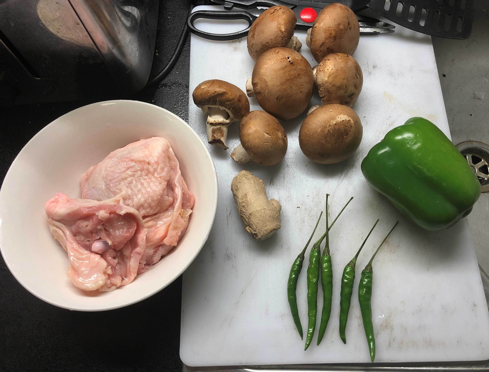
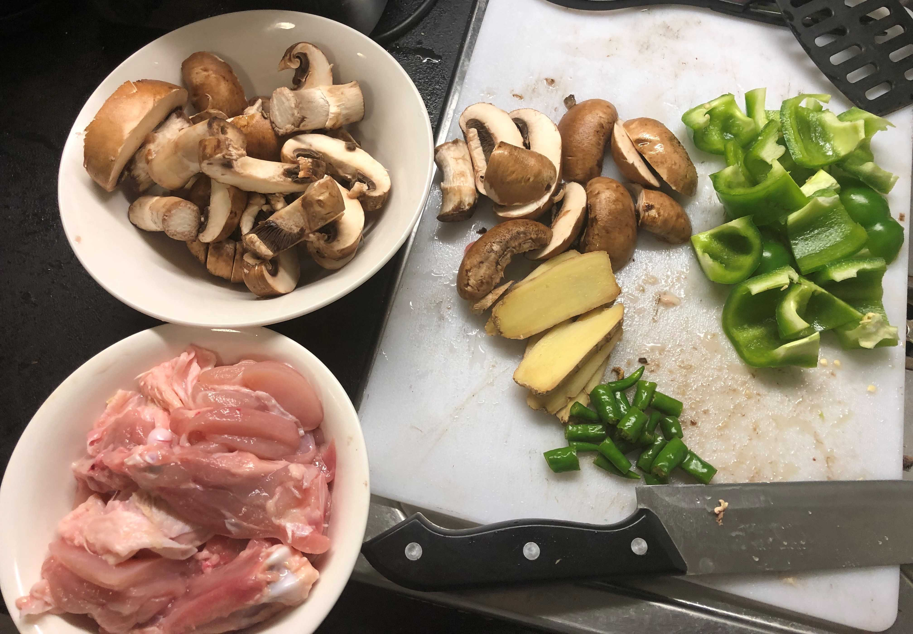
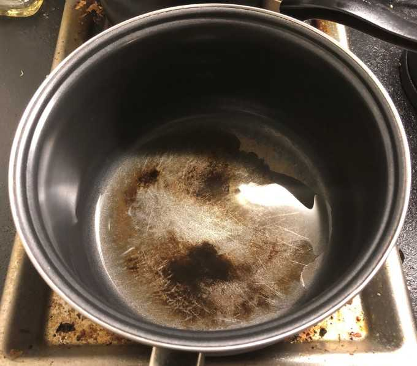
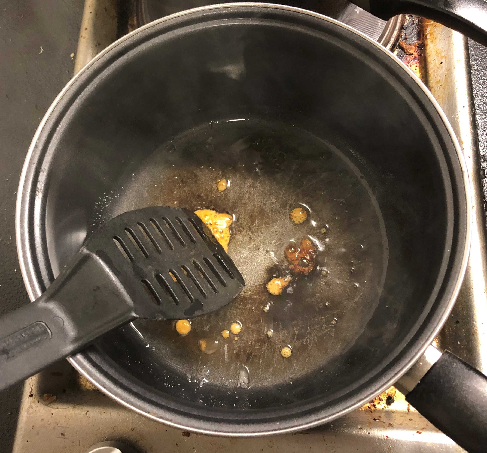
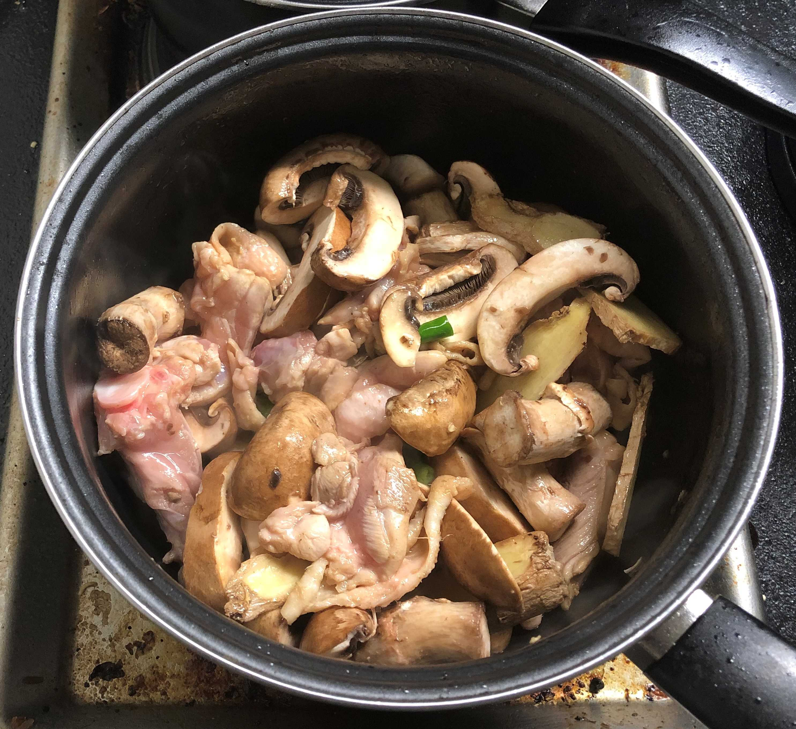
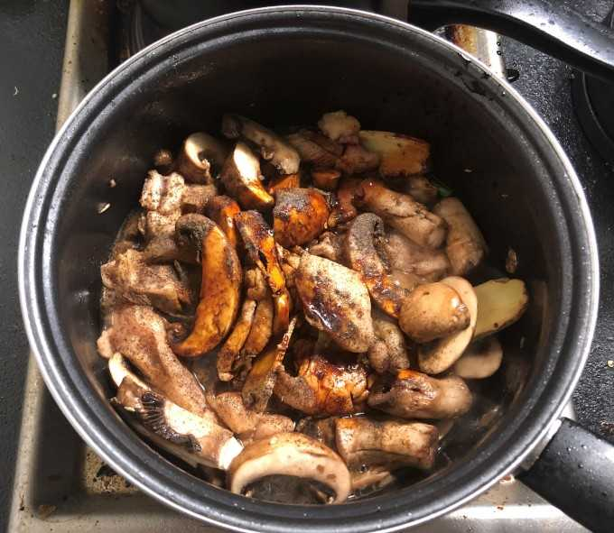
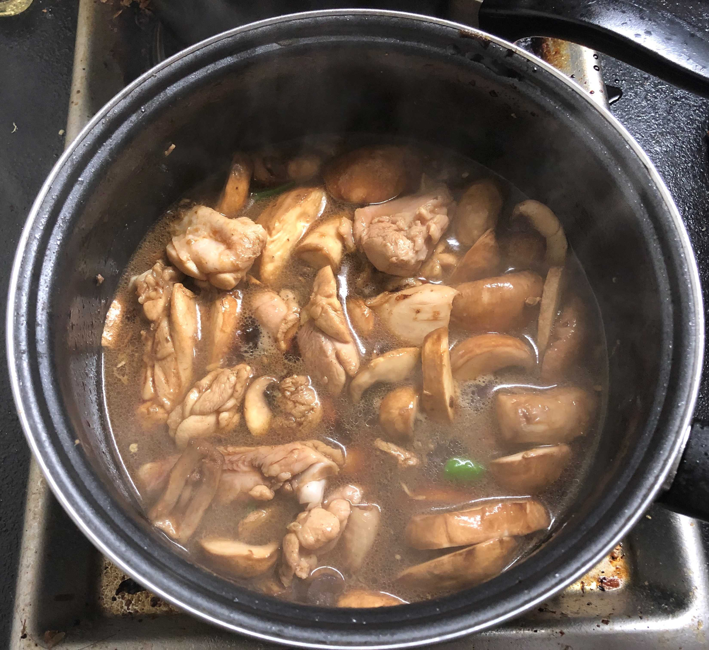
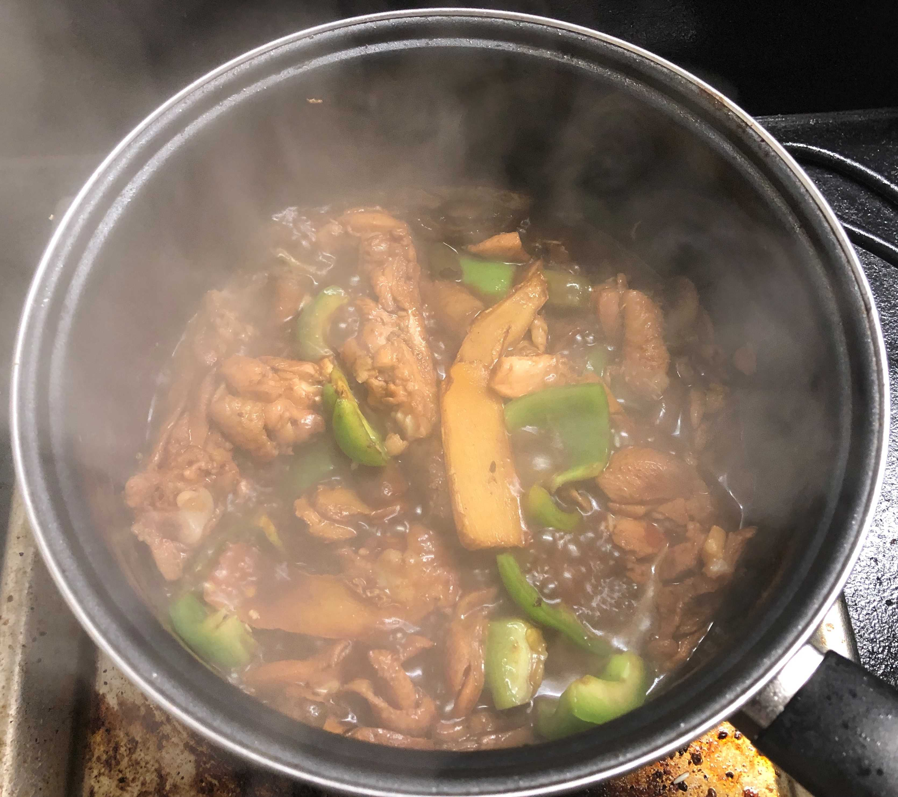
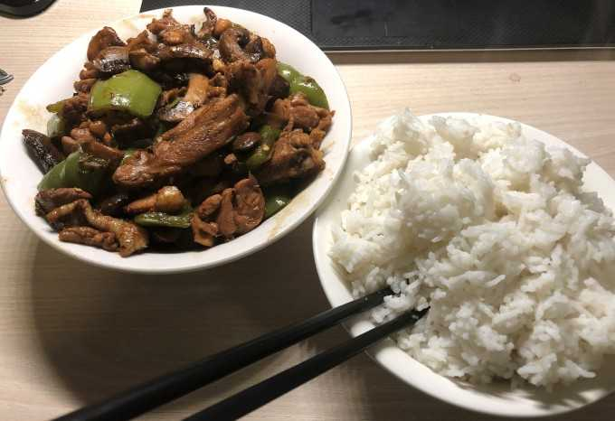

<!-- image-width: 70% -->

~~我这是在干什么~~

异国他乡的黄焖鸡菜谱，中超需求为酱油（生抽/老抽）

如果现在要我提名中餐代表菜，我一定会给黄焖鸡投上一票。简单易做好吃，简直就是在做菜想象力匮乏的英国的救世主，更重要的是绝大部分原材料可以在Local的便利店里买到，省去天天跑中超的烦恼 ~~去一趟中超40分钟10磅路费的乡下人落泪了~~。

**原料**：

鸡股 2只（400g)

菇类 n朵（200g)

灯椒 1个（100g)

生姜 1块（30-40g）

辣椒 m个（20g)

**调料**：

盐 生抽 老抽 胡椒粉 糖 食用油

**关于选料**：

1. 鸡股是指鸡腿的上方部分，也就是俗称手枪腿的上半截，肉质和鸡腿类似，但胜在容易切块。传统黄焖鸡使用鸡腿需要斩骨，这一工作还是有一定危险性的，选用鸡股可以避免这一点。还有一个优势在于英国Tesco有包装好的chicken thigh卖，一包四只鸡股正好两餐的食量 ~~然后灯椒三个一起卖强迫症快死了~~。
2. 菇类建议选择香菇，如果没有的话其他菇也是可以的，我一般是在Tesco里逛一圈哪种菇打折买哪种=。=
3. 辣椒的量请自行控制。其种类可以根据喜好选择，不同种类的辣椒理论上有一定差别，但是我个人体~~口~~感没感受到多少差异。
4. 胡椒粉黑白均可，糖块状或粉末状均可。

**流程**：

1. 鸡股切成中块，骨不切留一些鸡肉稍后一起下锅；香菇，生姜，灯椒切片；辣椒切小段。
2. 大火热锅，放入适量底油。
3. 炒糖色。放入糖后等待融化，过程不断用铲搅拌防止糊底。
4. 待糖融化呈棕色，下鸡肉翻炒，待鸡肉半熟下香菇片、生姜片、辣椒一起翻炒。
5. 约30秒后加入盐、生抽、胡椒粉、少量老抽调色，酱油和盐的量请根据口味控制。
6. 翻炒均匀后加水至将要没过鸡块，加盖调中小火炖煮约20分钟。
7. 放入灯椒片翻炒，调大火炖至基本收汁（不要太干）出锅。
8. 煮个米饭，开吃。

**注意事项**：如果想速度快一些，第六步可以不加盖直接大火炖到底；餐后请及时处理厨余垃圾 ~~过夜味道堪比生化武器~~
