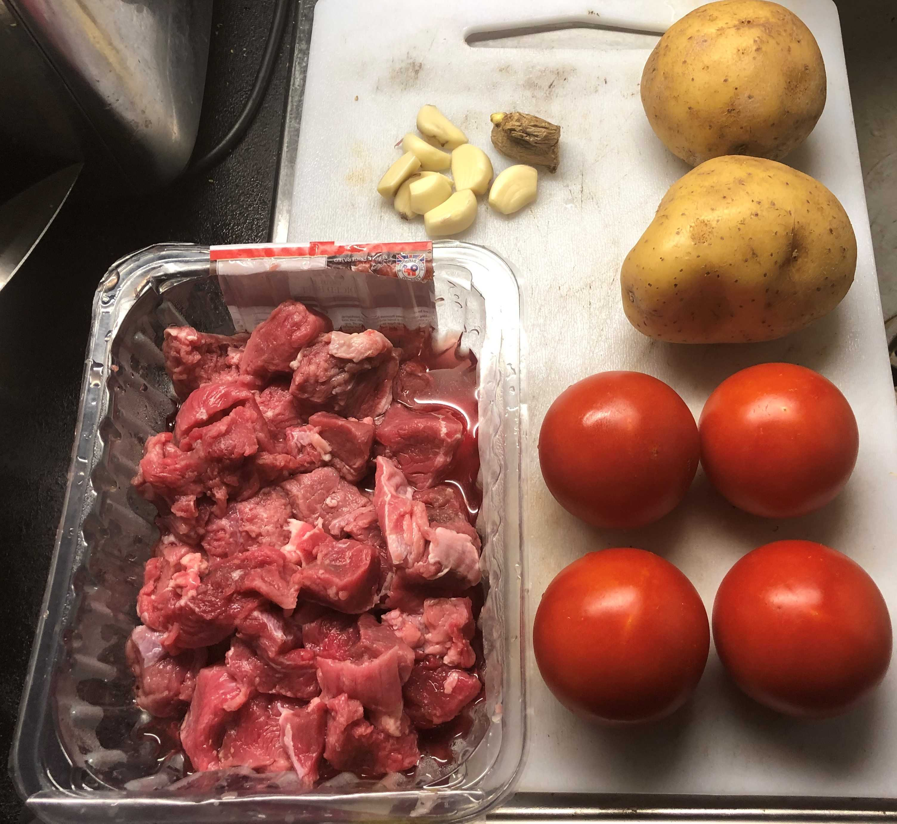
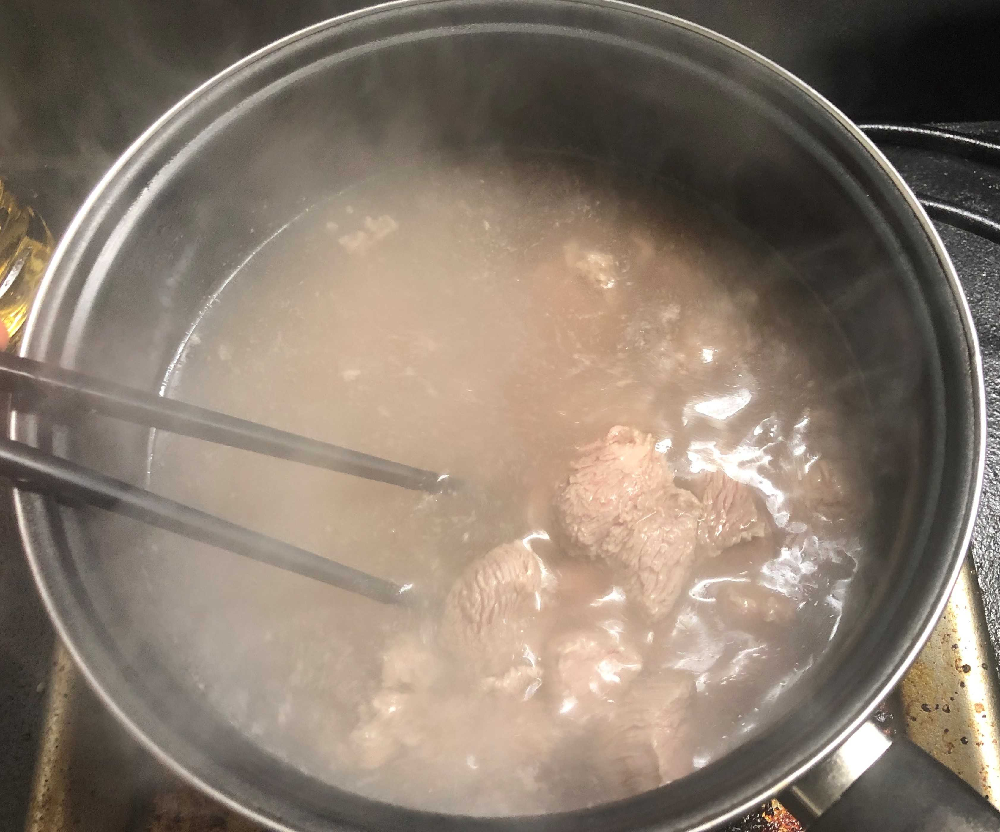
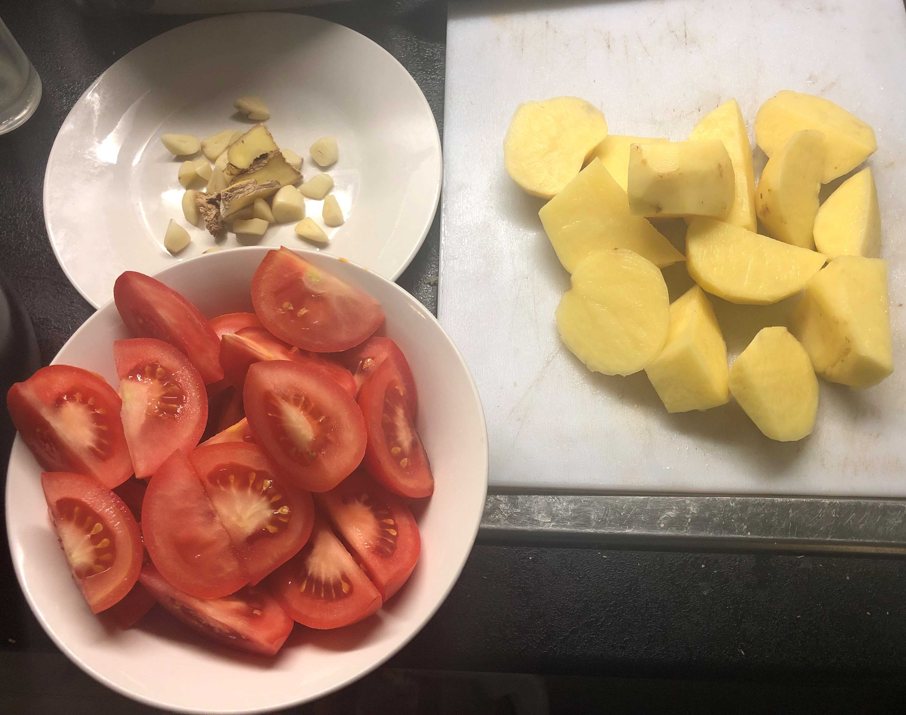
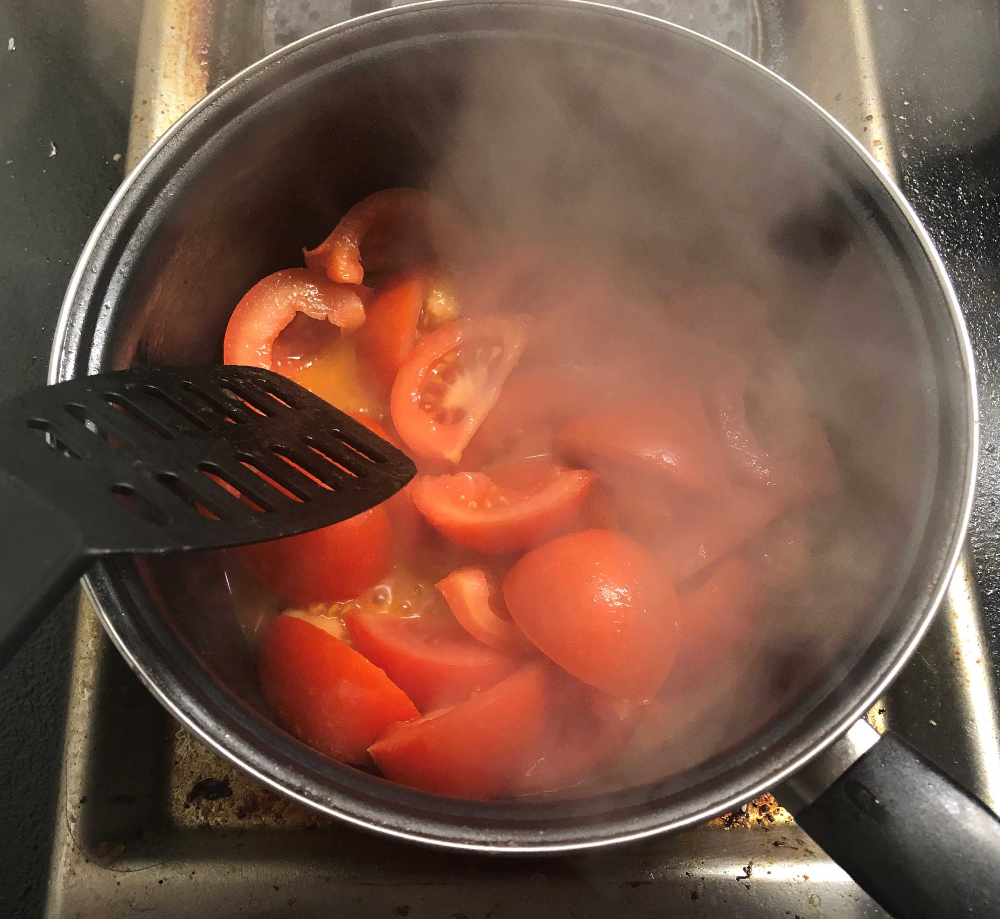
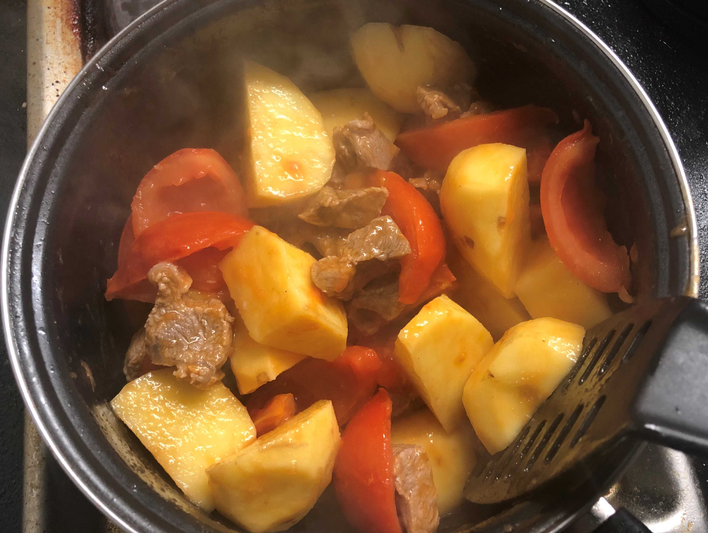
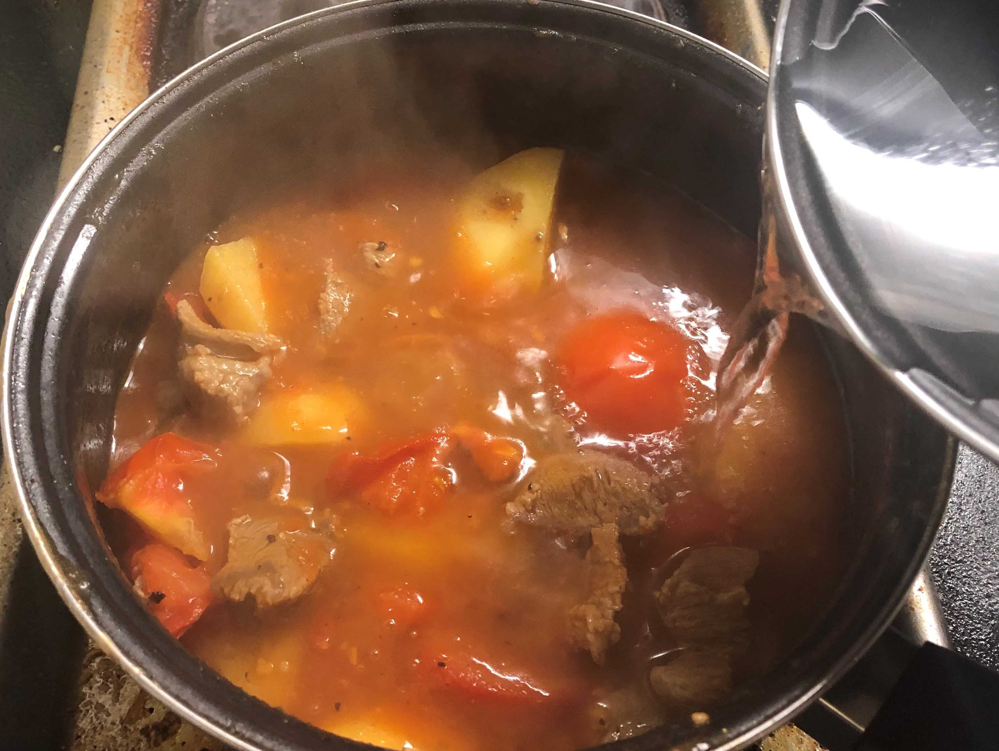
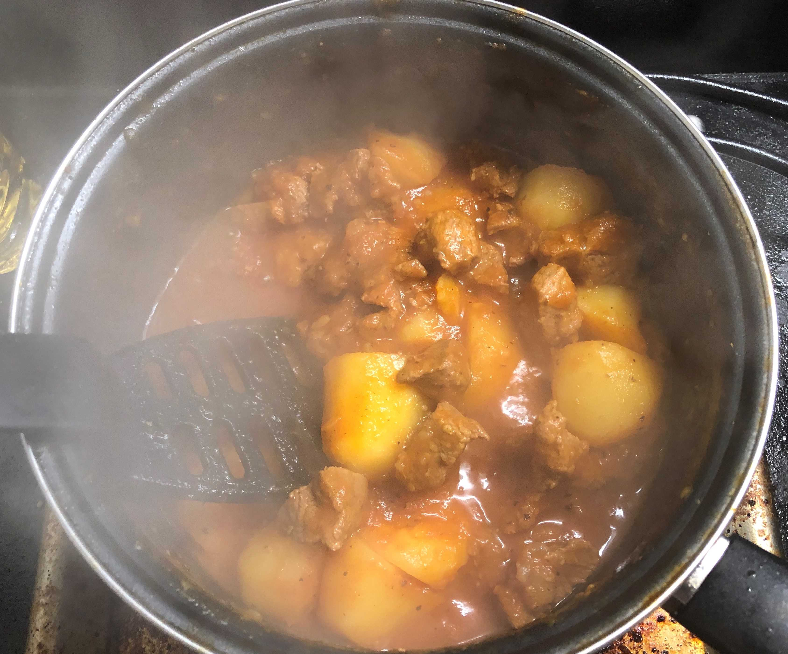
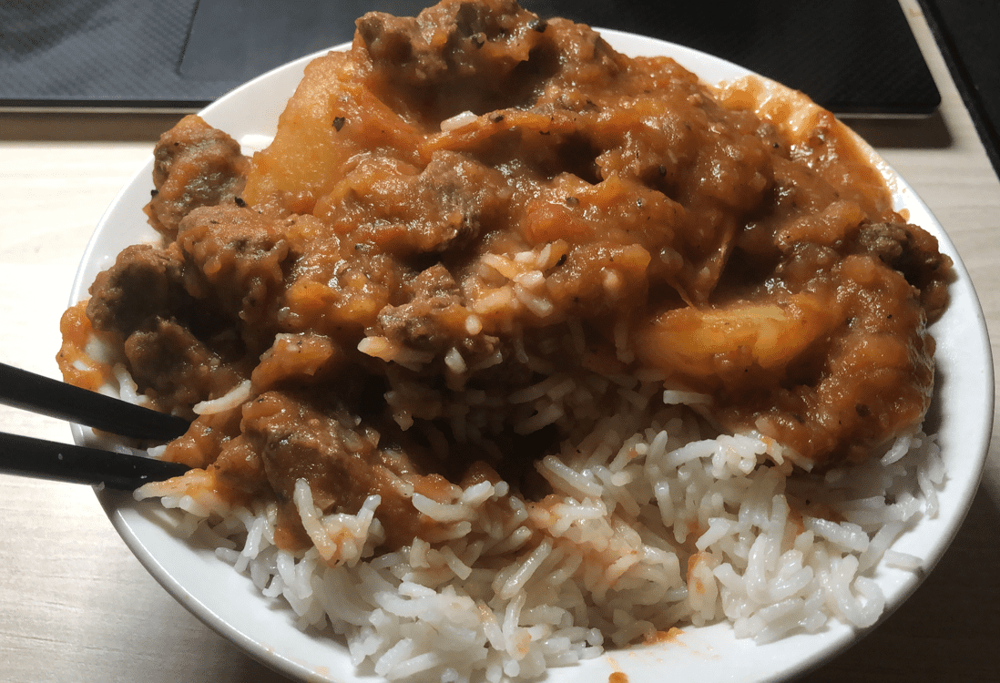

<!-- image-width: 70% -->

~~我这是在干什么2.0~~

中超需求为生抽/味精，也可以考虑不使用。

一个有趣的事实是，本系列的主角均是英国便利店（Tesco)可以买到的食材，大家可以脑补一个在便利店对着冰鲜柜台思考菜谱的笔者。

以下材料为两人份（准确地说是一人两餐份，汪汪）

**原料**：

牛腩 400g

土豆 2个（350g)

番茄 4个（~300g)

生姜 半块（10-20g）

大蒜 n瓣（40g)

**调料**：

盐 生抽 味精 胡椒碎 食用油 番茄酱

**关于选料**：

1. 这里的牛腩是Tesco的Diced Beef，自己买成块的切小丁也没差。以未速冻的新鲜肉为宜。
2. 嫌大蒜内皮难剥可以试试把头尾去掉，会自然地带下一部分皮。

**流程**：

1. 锅内加入适量开水，煮沸后加入牛腩炖煮3分钟左右，撇去浮沫。捞出牛腩，肉汤留下待用。
2. 番茄切块，姜切片，蒜切碎末。土豆去皮后亦切块（可以切小一点，图中的过大了）
3. 起锅入油，炒番茄至出汁，根据个人口味加入番茄酱。
4. 放入土豆与牛腩，翻炒均匀后加入盐、味精、胡椒碎。加入少量生抽调色（喜欢原色的话也可以不加）
5. 加入牛肉汤（控制量，以没过大部分食材为宜），加盖开中火炖煮40分钟左右。期间时不时用锅铲翻动食材，防止糊底。
6. 煮至汤汁成粘稠酱状，土豆可轻松用锅铲切开出锅。
7. 煮个米饭，开吃（似曾相识的结尾）

**注意事项**：40分钟仅为约数，请自行控制炖煮时间。过程需要时不时翻动食材，否则后半段黏度过高的时候很容易糊底。

下期可能做西餐……？
