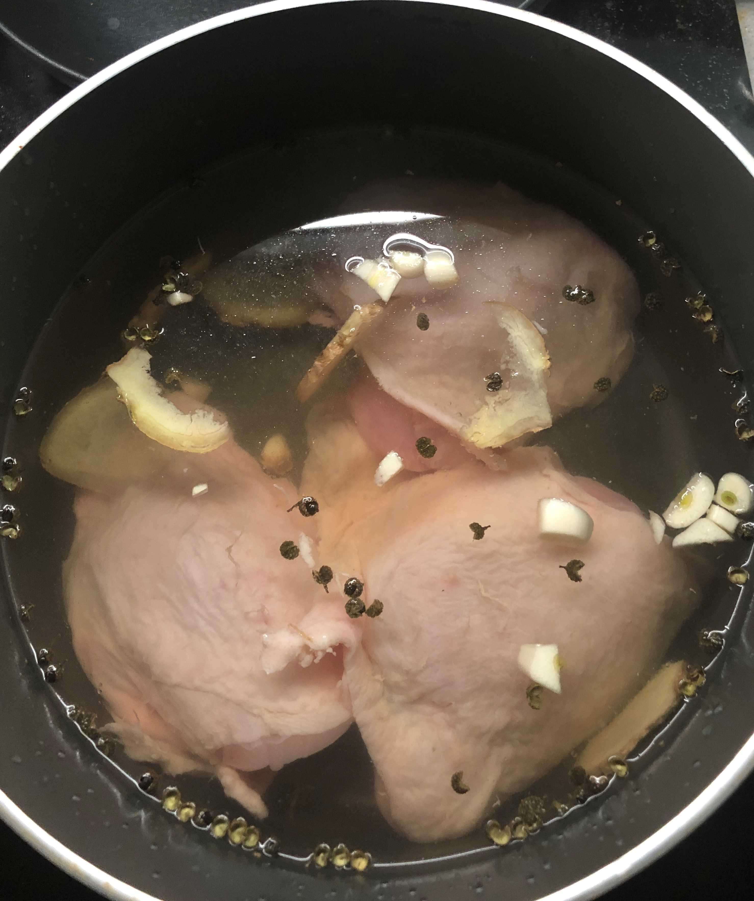
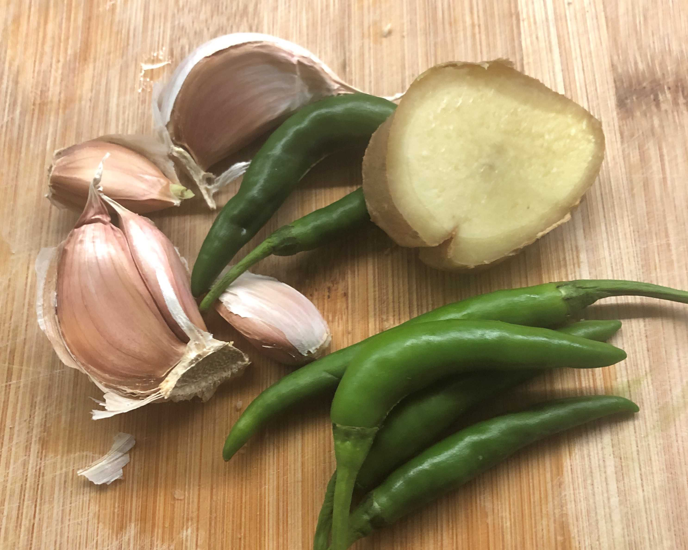
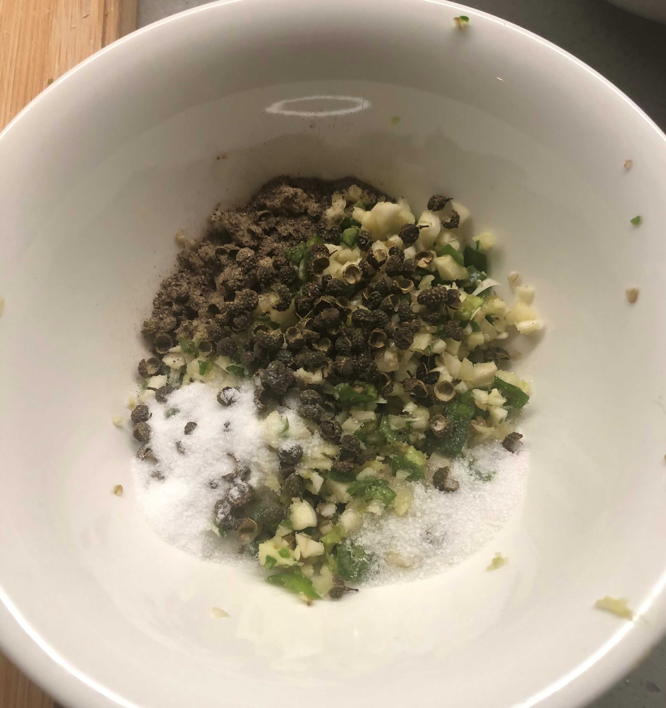
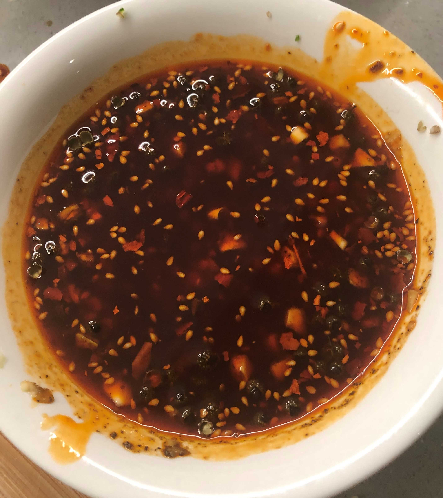
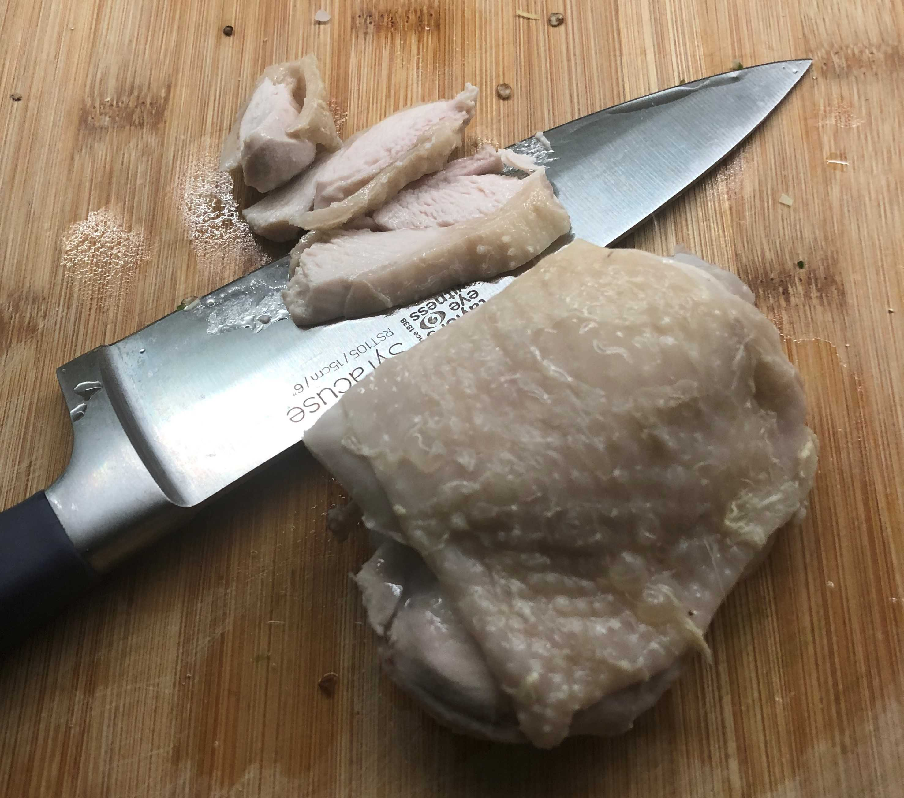
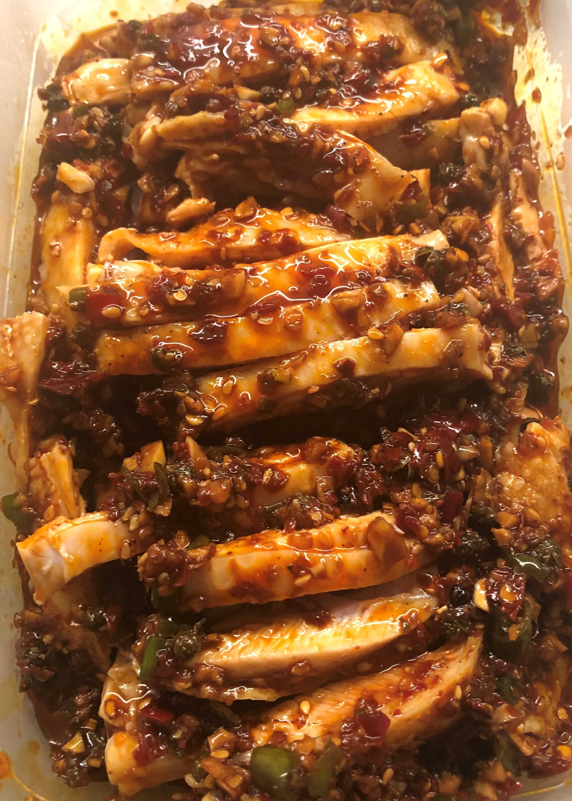
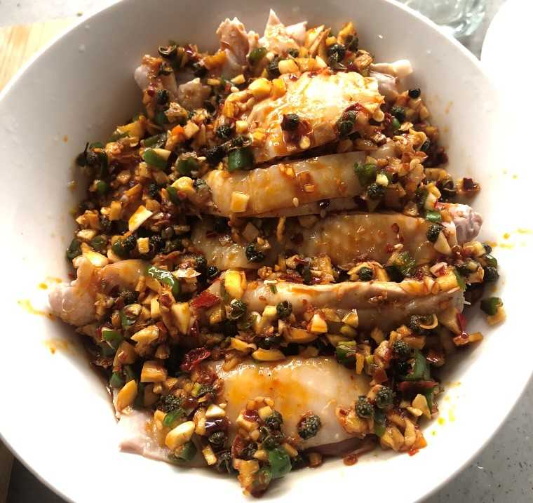
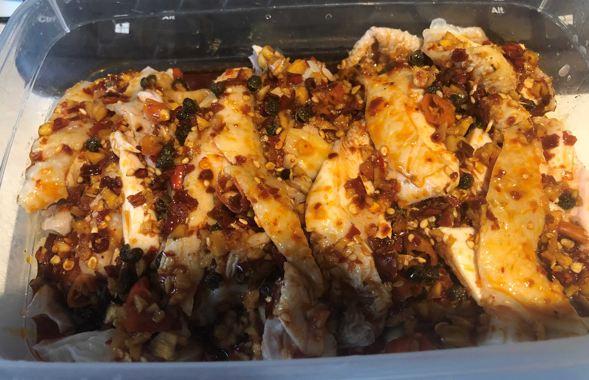

<!-- image-width: 70% -->

~~谁说这系列没下文了~~

著名凉拌菜的本地化改造。中超需求为酱油（生抽/老抽），香辣红油，香醋，料酒，青花椒

  一个显然但仍应当指出的事实是：这个系列的同种菜谱在互联网上俯仰皆是，写这些菜谱的初衷也不完全是单纯的教人做菜——不过笔者认为这些作为一人做饭一人食的倒霉蛋的个人经验，依旧对类似状态的读者有些分享的价值。更何况，它也能做为笔者这段时光的回忆之一。 ~~更何况我还给标题塞进了一个梗，不能不用~~

另一个不那么显然的事实：作为一个浙江人，笔者并不清楚椒麻鸡和口水鸡的具体区别。在此人眼中，它们都指代“浸有麻辣料汁的凉拌鸡肉”，但这并不妨碍他十分喜欢这道菜（为此，从来不吃醋的笔者特地为这道菜买了醋并已经用掉了小半瓶）

这道菜具有适用于独居人的一大优势：麻烦的料汁可以一次准备多顿的量，有效缓解了每天重复劳动的痛苦感，同时操作流程难度很低，是笔者相当推荐的选择。除非是忌辣人群，我鼓励有兴趣的朋友自己尝试一下。

**原料**：

鸡股 若干只（300~400g)

青花椒 一把（20g左右)

大蒜 4-5瓣（20g)

生姜 2块（30-40g）

类小米辣 m个（20g)

**调料**：

盐 糖 生抽 老抽 胡椒粉 香辣红油 食用油 料酒

**关于选料**：

1. 鸡股是指鸡腿的上方部分，也就是俗称手枪腿的上半截，肉质和鸡腿类似，但胜在容易切块。椒麻鸡的理想材料毫无疑问也是鸡腿，但使用鸡腿需要斩骨，这一工作还是有一定危险性的，选用鸡股可以避免这一点。~~如果你觉得上面这段描述很熟悉，那是因为这段是从黄焖鸡那篇原样复制过来的~~。但值得一提的是，英国Tesco包装好的chicken thigh已经不再是四个了，而是数量不定的七到久个，但是总重量并没有改变（英国的鸡不行了，越长越小）（或者说是因为杜伦的供货农场比伦敦的水平低？）
2. 辣椒的量请自行控制。有中超买的小米辣当然最好，但tesco售卖的尖椒起到的效果也大同小异。
3. 建议生姜去皮防止对口感的影响。

**流程**：

1. 鸡股洗净后入锅，加入适量料酒，生姜若干片，半把青花椒。加冷水至没过鸡肉，加盖大火烧开。
2. 煮沸后关火，留盖放置40分钟，用余温把鸡肉烫熟。此步是保证鸡肉口感的关键，请不要煮沸过久。
3. 剩余生姜，小米辣，大蒜切末，同青花椒一道放入碗中，加入胡椒粉、盐、糖。
4. 加入生抽、香醋、少量老抽着色。最后加入稍微多量的香辣红油，搅拌均匀。
5. 原则上上一步是泼油激发出料头的香气，但这么做太麻烦了，和独居人的画风不符。作为代替，将料汁放入微波炉加热大约60秒。加热完毕后再次搅拌均匀，放入冰箱冷藏室两小时。**注意加盖**，否则你的冰箱马上就全是这个味道了。
6. 烫熟的鸡股捞出后在冷水中浸泡变凉，随后按平行骨的方向切成宽半厘米左右的鸡块，在容器中码好。
7. 将冷却完毕的料汁淋上即可。

**注意事项**：这是一道凉菜，成菜温度过高会严重影响品质。无论是鸡肉还是料汁都要事先降温处理。餐后剩余的料汁可以放冰箱用于第二顿，但鸡肉最好每次只准备一次的量，新鲜的鸡肉口感是这道菜的关键之一。~~另，从营养均衡的角度考虑，建议读者用餐时另行准备素菜搭配~~

更多照骗：

