使用教材：An Introduction to Modern Astrophysics 

此部分为1-10章：天球/有心力学/连续光谱/SR/光物相互作用/望远镜/双星与星参数/恒星光谱分类/恒星大气/太阳

<!-- toc -->

### chapter 1

#### 1.赤道天球坐标系

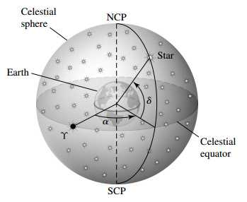

赤纬(declination) $\delta$ 表示恒星与地心连线与赤道面夹角的大小。

赤经(right ascension) $\alpha$ 表示连线在赤道面投影与春分点(vernal equinox, $\Upsilon$)的夹角。这个角度用小时表示，$360^\circ = 24h$. 一小时对应$15^\circ$. 

#### 2.坐标系进动

地球自转进动会影响星体在赤道天球坐标系下的坐标，需要约定一时间来给出统一的赤经和赤纬。如J2000.0将格林尼治时间2000年1月1日0点定为标准时，J指的是Julian calendar. 相对于这一标准时间时的赤经和赤纬，之后某时刻的坐标由下式给出

$$
\Delta\alpha =M+N\sin\alpha \tan\delta
$$

$$
\Delta \delta=N\cos\alpha
$$

式中M,N分别为

$$
M=1^\circ.2812323T+0^\circ.0003879T^2+0^\circ.0000101T^3​
$$

$$
N=0^\circ.5567530T-0^\circ.0001185T^2-0^\circ.0000116T^3
$$

$$
T=(t-2000.0)/100
$$

t是当前的日期，化成年为单位。

### chapter 2

#### 威利定理(virial theorem)

独立且处于平衡的引力作用体系，其总能量始终是时间平均势能的一半（势能和体系能量都是负的）。

### chapter 3

#### 1.星等（bolometric magnitudes）

视星等：比例关系需要基准定标（如设夜空最亮星体星等为1），其他星体星等由下式给定

$$
m_1-m_2=-2.5\log_{10}({F_1\over F_2})
$$

流量$F$和距离二次反比，距离变为两倍则流量降至四倍。

绝对星等：假定星体均位于10pc处的视星等。

距离模数(distance module)：视星等和绝对星等之差，显然有10pc内的模数为正，之外为负

$$
m-M=5\log_{10}({d\over 10pc})
$$

#### 2.光压

真空中电磁波能流密度由Poynting vector决定，其平均值$\langle S\rangle ={1\over 2\mu_0}E_0B_0$，吸收与反射的光压表达式为

$$
F_{ab}={\langle S\rangle A\over c}\cos\theta,~F_{re}={2\langle S\rangle A\over c}\cos^2\theta
$$

#### 3.单色光度(monochromatic luminosity)

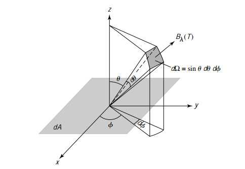

从$dA$面积黑体上向单位立体角$d\Omega$发射的能量强度为$B_\lambda d\lambda dA\cos\theta\sin\theta d\theta d\phi$，积分积掉面积和立体角（设球形天体有面积积分为$4\pi R^2$)

$$
L_\nu d\lambda =4\pi^2 R^2 B_\lambda d\lambda={8\pi^2R^2hc^2/\lambda^5\over e^{hc/\lambda kT}-1}d\lambda
$$

这被称为单色光度，其对全波段积分结果应与斯特藩定理给出结果相同

$$
\int^\infty_0  B_\lambda(T)d\lambda={\sigma T^4\over \pi}
$$

单色光度除以包络面积即为单色流量（monochromatic luminosity）

#### 4.比色指数(color index)

UBV：U=ultraviolet，中心365nm，有效带宽68nm. B=blue，中心440nm， 有效带宽98nm. V=visual，中心550nm，有效带宽89nm.B-V和U-B是两个衡量星体“颜色”的重要指标，越小说明越“蓝”

热辐射修正(bolometric correction)：星等减V段星等

$$
BC=m_{bol}-V=M_{bol}-M_V
$$

sensitivity function $S(\lambda)$：接收到特定波长光的比例，特定星体某个波段的星等有

$$
U=-2.5\log_{10}(\int^\infty_0F_\lambda S_U d\lambda)+C_U
$$

常数可根据情况取，例如取值令Vega($\alpha$ Lyrae, 织女一)的各个波段星等为0。注意此时$C_U,C_B,C_V$不同，三波段光流量也不同，虽然三波段的星等均为0.

#### 5.颜色-颜色图(color-color diagram)

由于星体并非真正的黑体，所以在图上的位置会偏离黑体线

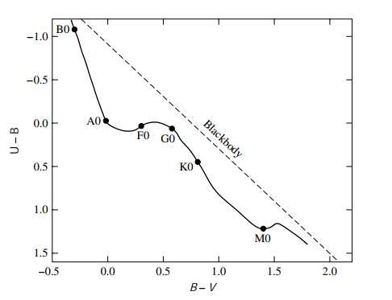

### chapter 4

#### 1.SR红移

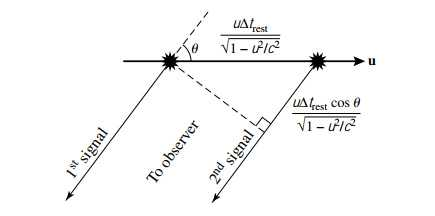

$$
v_{obs}=v_{rest}{\sqrt{1-u^2/c^2}\over 1+v_r c}
$$

$$
v_{obs}=v_{rest}\sqrt{1-v_r/c\over 1+v_r/c}
$$

相对速度在远离时取正

红移参数$z$

$$
z={\Delta\lambda\over\lambda_{rest}}=\sqrt{1+v_r/c\over 1-v_r/c}-1 \approx v_r/c
$$

$$
z+1={\Delta t_{obs}\over\Delta t_{rest}}
$$

上式说明观测到的事件间隔与事件发生地静止系中的间隔有$z+1$倍差。

#### 2.同步辐射 (synchrotron radiation) 与前灯效应 (headlight effect)

相对论速度电子绕磁场线运动，发出的强线偏振辐射因前灯效应聚集在朝运动方向的圆锥中。

### chapter 5

#### Kirchhoff定律

​    i. 热而致密 (hot and dense) 的气体或热固体发射连续谱(continuous spectrum)，无暗线。

​    ii.热而稀疏(diffuse)的气体发射亮光谱线(emission lines).

​    iii.在连续谱发射源前阻挡的冷而稀疏的气体会在连续谱上留下吸收线(absorption lines).

### chapter 6

#### 1.Rayleigh判据

对于直径$D$的孔径，其最小角分辨率为

$$
\theta_{min}=1.22{\lambda\over D}
$$

#### 2.illumination $J$ 与 focal ratio $F$

$$
F=f/D,~J\propto 1/F^2
$$

$J$用于描述汇聚望远镜汇聚光的能力，由1,2可以看出望远镜口径加大能同时提高分辨率和亮度。

#### 3.jansky(Jy)

$$
1Jy=10^{-26}Wm^{-2}Hz^{-1}
$$

常规射电源的强度，另有$mJy$

### chapter 7

#### 1.双星系统分类

Optical double：天球方位相同，两者不处在一个引力系统中。

Visual binary：双星均能单独观测。

Astrometric binary：其中一颗比另一颗亮的多导致暗星不可见，通过亮星的振动轨迹可推测暗星信息。

Eclipsing binary：轨道平面和视线共面，双星会周期性互相遮挡导致观测到的光度周期性变化。

Spectrum binary：两星重叠得非常严重，但两者具有区分度较大的光谱，则可以通过光谱周期性的相反蓝红移来判断双星。

Spectroscopic binary：如果条件不那么苛刻，靠单星的周期运动导致的光谱移动也可以判定双星的存在。

#### 2.Visual binary推定质量

轨道半长轴比得到质量比例，周期根据开三得到质量和。真实轨道和天球面夹角(angle of inclination) $i$ 不会影响质量比，但会影响质量和的结果。根据真实焦点和观测焦点的偏离可以推测 $i$ 大小。

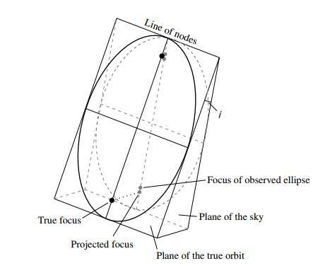

#### 3.Eclipsing binary推定星体半径与温度比

根据小星被大星遮挡和出现的时差和相对速度可以推定半径，根据亮度差能够推定温度比（由于传播过程未知，不能确定具体温度）

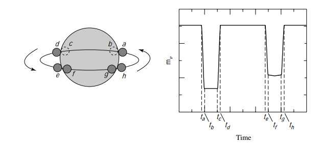

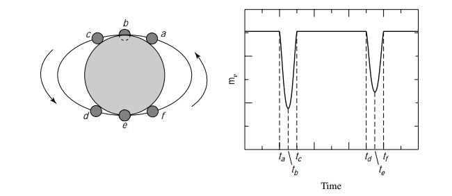

### chapter 8

#### 1.OBAFGKMLT与Henry Draper Catalogue

温度逐渐降低，处于末尾的多为褐矮星；内另有0-9的分级；从early-type到late-type。星体编号有HDxxxx

#### 2.光谱特征

从O到A氢吸收线逐渐加强，随后减弱。late-type恒星因金属元素谱线光谱十分复杂。

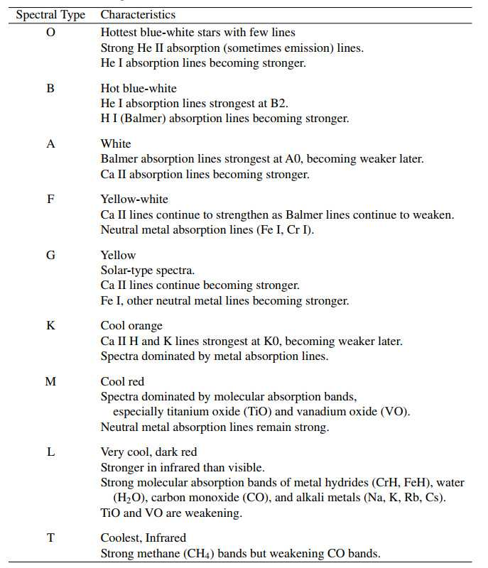

谱线的分布取决于恒星大气中电子原本处于哪些轨道中，将利用含简并的玻尔兹曼分布

$$
{N(E_b)\over N(E_a)}={g_b e^{-E_b/kT}\over g_a e^{-Ea/kT}}={g_b\over g_a}e^{-(E_b-E_a)/kT}
$$

上式描述不同激发态电子数关系，另有Saha方程描述不同电离态(ionization stage)电子数关系

$$
{N_{i+1}\over N_{i}}={2Z_{i+1}\over n_e Z_i}({2\pi m_e kT\over h^2})^{3/2}e^{-\chi_i/kT}
$$

其中$i$下标表示特定电离态，越大电离程度越高，$\chi_i$表示从$i$电离态到$i+1$电离态需要的电离能，$Z$为特定电离态的配分函数 (partition function) $Z=\sum_{j=1}^\infty g_j e^{-(E_j-E_1)/k T}$，能量越高的态权重越低。注意Saha方程中自由电子密度在分母项，密度越高高电离态的离子就越少，因为他们越容易找到电子结合。有时也会使用自由电子气的状态方程$P_e=n_e k T$改写上式。

Saha方程仅能用于热平衡系统，且气体密度不能太大。

#### 3.赫-罗图(Hertzsprung-Russell Diagram)与Morgan-Keenan Luminosity Classes

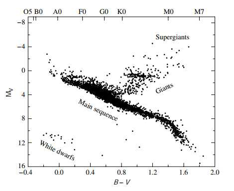

MK分类在原来的基础上额外考虑了谱线宽度，一般来说谱线越窄的恒星越亮，因为它们的大气更稀薄，原子间更少发生碰撞，对原子轨道的干扰就越小，那么在轨道之间跃迁的能量误差就会越小。利用MK分类可以定位恒星在赫罗图上的位置，随后根据绝对星等和视星等的差就可推算距离。这一方法被称为光谱视差(spectroscopic parallax)

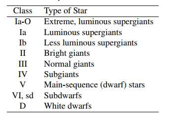

### chapter 9 P263

#### 1.辐射场描述

具体推导参见Textbook P263-269

specific intensity: $E_\lambda d\lambda=I_\lambda d\lambda dtdA\cos\theta d\Omega$，注意"$E_\lambda$"单位是$W nm^{-1}$，故specific intensity单位是$W nm^{-1} m^{-2} s^{-1}$

对立体角积分得到 mean intensity: $\langle I_\lambda\rangle={1\over 4\pi}\int I_\lambda d\Omega$, 亦有标记$J_\lambda$

 specific energy density: $u_\lambda d\lambda={1\over c}\int I_\lambda d\lambda d\Omega={4\pi\over c}\langle I_\lambda \rangle d\lambda,~u={4\pi\over c}\int^\infty_0 B_\lambda(T)d\lambda={4\sigma T^4\over c}$

specific radiative flux: $F_\lambda d\lambda=\int I_\lambda d\lambda \cos\theta d\Omega$, 各项同性辐射场的flux显然是0

radiation pressure: $dp_\lambda d\lambda ={2\over c}I_\lambda d\lambda dt dA\cos^2\theta d\Omega,~P_{rad}={1\over c}\int_\lambda \int_\Omega I_\lambda d\lambda \cos^2\theta d\Omega={4\pi\over 3c}\int^\infty_0 B_\lambda(T)d\lambda={1\over 3}u$, 注意其中2因子被去除，因为在气体内部不存在反射过程。

#### 2.光学厚度

thermodynamic equilibrium 和 local thermodynamic equilibrium: 略

mean free path: $l={vt\over n\sigma vt}={1\over n\sigma}$

Opacity: $dI_\lambda=-\kappa_\lambda \rho I_\lambda ds$, 辐射通过介质强度降低，其与介质密度、辐射强度和通过距离成正比，负号表示被吸收；比例系数$\kappa_\lambda$称为absorption coefficient 或 (monochromatic) opacity, 单位质量介质的截面大小 (?).

optical depth: $d\tau_\lambda=-\kappa_\lambda\rho ds,~I_\lambda=I_{\lambda,0}e^{-\tau_\lambda}$, optical depth可以视为视线方向上辐射通过的mean free path的数量，因为$\kappa_\lambda \rho$ 和 $n\sigma$ 分别能看做是通过单位距离被散射或吸收的光子比例/数 (考察定义)，一般$\tau\approx1$以下的深度难以被看见。$\tau<<1$称为 optical thin，反之称为optical thick. **注意$\tau$的符号与距离相反，从源出发$\tau$在减小。一般设表面的$\tau=0$.**

source of optical depth: 

​    Bound-bound transition, 在能级间跃迁的吸收，由于吸收的是特定能量的光子，故$\kappa_{bb}$主要贡献线吸收。

​    Bound-free transition, 光致离子化，最后的电子能量任意，故$\kappa_{bf}$主要贡献连续吸收。

​    Free-free absorption, 在离子附近的**自由**电子吸收光子，注意孤立的自由电子无法吸收光子（能动量不守恒），由于吸收光子能量任意，故$\kappa_{ff}$主要贡献连续吸收。

​    Electron scattering, Thomson scattering (自由电子) /Compton scattering (loosely bounded electron, 且波长远小于原子尺寸)/Rayleigh scattering (波长远大于原子尺寸)过程。由于电子截面很小，此项$\kappa_{es}$只在极高温、自由电子密度很大的情况下起主导作用，此时包含电子bound state的项因为几乎完全电离而消失。Rayleigh scattering 截面正比于$1/\lambda^4$，在大部分大气中都能被忽略，但在超巨星extended envelope的UV波段和冷主序星上较为重要。

**Balmer jump**: 指介质吸收了大量能把n=2氢电离的辐射导致在短波段的流量下降，由于这一下降程度取决于处于n=2的氢比例，间接与温度相关，则可以利用测量Balmer jump的程度来测定温度。

**Rosseland Mean Opacity**: 根据黑体谱随温度变化幅度做权重函数计算平均opacity

$$
{1\over\bar{\kappa}}={\int^\infty_0 {1\over\kappa_\nu}{\partial B_\nu (T)\over \partial T}d\nu\over\int^\infty_0{\partial B_\nu (T)\over \partial T}d\nu}
$$

**Kramers opacity law**: 即$\bar{\kappa}=\kappa_0 \rho/T^{3.5}$, 出现于bf和ff过程中。

**F0后恒星的连续性吸收主要来自于$H^-$的光致电离，B和A型主要是氢原子和free-free过程，O型主要是电子散射。**

#### 3.辐射转移方程

emission coefficient: $dI_\lambda =j_\lambda\rho ds$, 单位是$ms^{-3}sr^{-1}$.

transfer equation: 

$$
-{1\over\kappa_\lambda \rho}{dI_\lambda\over ds}=I_\lambda-S_\lambda~\to~{dI_\lambda\over d\tau_\lambda}=I_\lambda-S_\lambda
$$

其中 $S_\lambda\equiv j_\lambda/\kappa_\lambda$ 被称为 source function，显然当辐射intensity大于source function时辐射就会减弱，反之加强。如果考虑局域平衡，$I_\lambda$ 应趋于和 $S_\lambda$ 相等，虽然source function的变化速度可能很快导致平衡态难以达到。

​    LTE条件下，$S_\lambda=B_\lambda$, TE条件下追加 $I_\lambda=B_\lambda$.

**plane-parallel grey atmosphere**: 设$\kappa=\bar{\kappa}=constant$与光波长无关，则$\tau$也与波长无关（灰大气）。具体推导参见Textbook P290-296

$$
{dF_{rad}\over d\tau_\nu}=4\pi(\langle I\rangle-S)
$$

$$
{dP_{rad}\over d\tau_\nu}={1\over c}F_{rad}~\to~{dP_{rad}\over dr}=-{\bar{\kappa}\rho\over c}F_{rad}
$$

平面平行大气中Flux应恒定，则$\langle I\rangle=S$.

​    根据Eddington approximation (向外的intensity为恒定值$I_{out}$, 向内的intensity为恒定值$I_{in}$), 能够得到温度随$\tau$变化形式:

$$
T^4={3\over 4}T_e^4(\tau+{2\over 3})
$$

此式说明等效温度大约是$\tau=2/3$处的实际温度，物理上可以理解为是观测到的光子源头的平均深度。

**Limb Darkening**：直接积分transfer equation可以得到

$$
I_\lambda(0)=I_{\lambda,0}e^{-\tau_\lambda,0}-\int^0_{\tau_{\lambda,0}}S_\lambda e^{-\tau_\lambda}d\tau_\lambda
$$

此式的物理意义非常明显。注意第二项也是正的，因为$d\tau_\lambda$与从发射点出发的路径$ds$符号相反

利用平面平行(**非灰**)大气假设，将辐射出发点设为无限远处并令$S_\nu=a+b\tau_\nu$ 得到 intensity 对角度的依赖关系

$$
I_\lambda(0)=a_\lambda+b_\lambda\cos\theta
$$

加入灰大气假设和Eddington approximation，利用$S=\langle I\rangle={3\sigma\over 4\pi}T_e^4 (\tau+{2\over 3})$能得到两个常数的取值，最后有

$$
{I(\theta)\over I(\theta=0)}={2\over 5}+{3\over 5}\cos\theta
$$

对太阳的观测证实这一结果的合理性 (an incredible fit!)

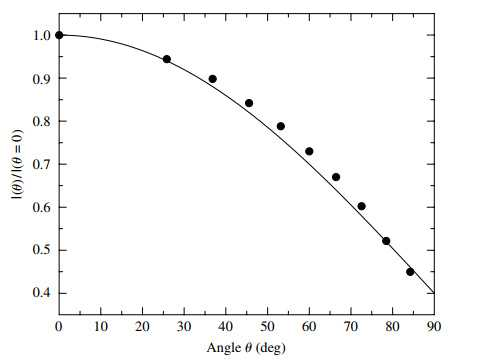

#### 4.谱线轮廓

equivalent width: 将真实谱流量除以平滑的连续谱流量做比例图，对谱线凹陷处的区域进行积分，得到的结果有距离量纲，其可以等效为高度为1(平滑连续谱的高度)的一个波长宽度，称为equivalent width.

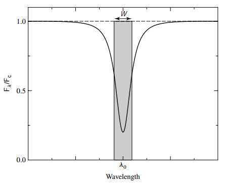

Broaden Spectral lines:

​    Natural broadening: 来自不确定性原理。

​    Doppler broadening: 来自原子运动导致的多普勒效应，比自然展宽要大得多。若有turbulent motion也要计入此部分展宽，对巨星和超巨星尤为重要（这些恒星上的湍流最早是由于反常大的多普勒展宽发现的）。

​    Pressure (and collisional) broadening: 也叫damping/Lorentz profile. 来自原子之间的碰撞。与大气介质密度有关。

#### 5.Voigt profile 和 curve of growth

voigt profile: 整体轮廓主要有Doppler与Pressure两部分展宽构成，一般来说Doppler决定线心，而Pressure决定线翼。

Schuster-Schwarzschild model: 恒星由发射黑体连续谱的光球核心与表面产生吸收线的覆盖大气构成，设$N$称为column density用于衡量光球层上方**直到表面**单位面积上的特定原子的数量（量纲为$m^{-2}$)

f-values/oscillator strengths: $f$定义为一个特定元素原子能为特定的跃迁（也就是特定的吸收线）提供的有效电子的数量（显然这一数量是小于1的，除非该种原子只能发生一种跃迁），$fN$代表单位面积上能够产生特定吸收线的原子数量（例如$f=0.1,~N=10 m^{-2}$, 则每平方米能产生此谱线的原子等效来看仅有一个）

Curve of Growth: equivalent width 与 $fN_a$ 的关系，当两者取对数时，从小到大$W$分别正比于$N_a,\sqrt{\ln N_a},\sqrt{N_a}$. 生长曲线的重要应用是通过若干条吸收原子是同一初态的谱线的等效宽度，求特定元素原子密度，参见P308-309的重要例子。同样也可以用不同初态的数据得到两个态之间的比例，然后代回Saha或者Boltzmann方程求温度、电子气压强（如果另一个已知）.

### chapter 10 P321

#### 1.太阳内部结构

标准G2主序星，半径和亮度都随寿命在逐渐加大。太阳内层为辐射，外层对流。比太阳稍重的恒星内核也有对流，对流发生条件称为superadiabatic, 为

$$
|{dT\over dr} |_{act}>|{dT\over dr}|_{act}~\to~{d\ln P\over d\ln T}<2.5
$$

箭头使用了单原子理想气体假设。

温度梯度与opacity成正比，梯度很大时对流比辐射效率更高。

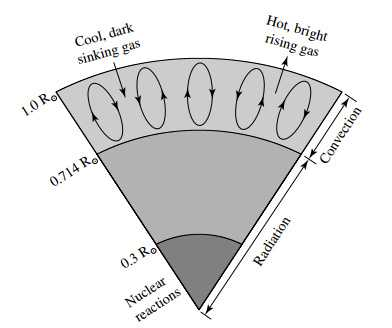

#### 2.太阳中微子问题

故事见P328. $SNU=\mathrm{solar~neutrino~unit}\equiv 10^{-36} \mathrm{reactions~per~target~atom~per~second}$. 由于中微子在三种flavors之间震荡，探测到的来自太阳核反应的电子中微子数量比预测中小。这说明中微子有质量。

#### 3.太阳大气

**Photosphere**: 光球层是我们所视大部分光子的来源，因为其下方的恒星内部太深而不可见。其底部以此为定义，注意其选择具有一定任意性。光球层底部以下的恒星可以视为黑体辐射源(并加上$H^-$导致的连续吸收). 太阳的光球层底部是 $\tau_{500nm}=1$ 下方100km处，$\tau_{500}\approx23.6,~T\approx 9400K$. 往上恒星的温度最低点定义为光球层顶部，太阳的顶部$T=4400K$. 我们常说的恒星半径指光球层以下的部分，其锋利的边缘是因为光球层急速变化的opacity导致的。

一条谱线的不同部分可能是在大气内不同高度上形成的。线心形成的位置要更高，因为线心波长上的光学厚度更厚，所以看进中心的距离会更浅（换句话说，连续谱的生成地更高，所以吸收线形成的位置也更高）

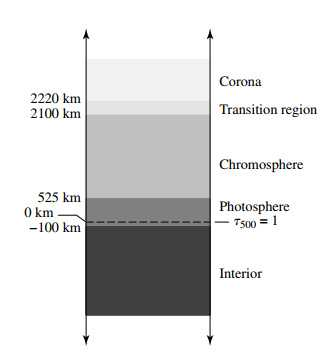

**Solar Granulation**: convection与光球层的交界因为不断出现的bubble导致明暗反复变化，从谱线的多普勒结果来看，一部分表面在上升（携带能量的bubble，发亮）而另一部分表面在下沉（到达光球层后能量以光子形式释放，自身冷却下沉，变暗）。径向速度在 $0.4km ~s^{-1}$ 左右。

**Differential Rotation**: 根据对太阳边缘的多普勒结果说明其自转根据维度而异，纬度越低转的部分越快。同时也和深度有关，表面不同速度旋转的部分在到达辐射区域后在 tachocline (差旋层) 汇聚为同一速度，这一区域可能是太阳磁场的来源。

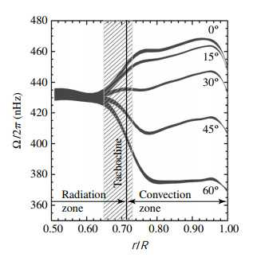

**Chromosphere**: 气体密度在色球层下降了四个数量级，同时intensity也下降了四个数量级。温度反升至$10000K$, 在低温高密度的光球层没有形成的吸收线大多形成于色球层（包括一些金属线）。同时亦有短波段的发射线出现。平常被太阳盖住的可见光段发射线在日全食开始和结束阶段能被观测到，称为 **flash spectrum**  (特别是$H\alpha$线) . 利用这种方式能够观测到 **Supergranulation** 以及 **spicules** (针状体). 前者是更巨大的granulation，后者是从色球处向外喷出的热气流，单个spicules的寿命只有15分钟，但每一时刻总有一定比例的表面被spicules覆盖。

**Transition Region**: 色球层之上，温度在100km的距离上增大一个数量级到达$10^5K$. 

​    在转变层下方：引力起主导作用导致太阳的层状结构，氦没有被完全电离，主要形成吸收线，结构由流体力学和气体压强主导。

​    在转变层上方：动力学起主导作用，氦完全电离，有大量远紫外和X-ray发射线，结构由磁场力主导。

​    氦完全电离使得其无法有效地通过莱曼线系的辐射发射能量，导致温度骤升（这是一个类似水沸的相变），相似地，只要其损失一点能量它的温度就会快速下降 (这两个现象被称为evaporation与condensed)

**Corona**: intensity大概比光球小6个数量级，其上界难以定义。日冕层密度极低，LTE假设不适用，这种情况下难以定义统一的温度。但从热运动展宽、电离程度和辐射强度得到的结果比较一致。日冕层温度在 $2\times 10^6 K$ 以上。

​    K corona: 发射连续谱，来源是光球层的辐射与其中的自由电子相散射，由于极高的热运动速度这一部分谱线宽度极大，以至于看上去是连续谱。位置在$1-2.3R_\odot$

​    F corona: 光球层辐射与$2.3R_\odot$以上的尘埃颗粒发生散射产生带吸收线的连续谱。尘埃颗粒比电子大得多也慢得多，所以这些谱线的宽度不大。Zodiacal light (黄道光) 实际上也可称为 F corona的一部分。

​    E corona: 日冕中产生发射线的部分，贯穿于整个K, F corona之中。

​    光球层辐射是峰在可见光段的黑体谱，其两头辐射很小，corona的发射线包括长波部分（来自free-free transition）以及更多的紫外部分（极高离子化和高能自由电子）

**Coronal holes and solar wind**: 冕洞指的是日冕上相对冷且暗的部分，其对应的是太阳磁场线开放的部分（延伸到无穷远处的磁场线），该区域带电粒子绕磁场线螺旋向外发射形成 (快速，fast) solar wind. 反之热且亮的区域是磁场线闭合的部分，此区域的corona streamer是(慢速，slow) solar wind的来源。太阳风被拘束在 Van Allen radiation belt内与地球磁场两级附近原子碰撞是极光的成因。

The Parker wind model: 假设太阳风内部等温、并在各处流体静力学平衡，能够估计其压强分布

$$
P(r)=P_0 e^{-\lambda(1-r_0/r)},~\lambda\equiv {GM_\odot m_p\over 2kTr_0},~P_0=2n_0kT
$$

注意这说明在无穷远处太阳风的压强也不会变成0（比星际间物质压强大得多），根据观测太阳风内部温度随距离降低的速度很慢。

太阳大气的Hydrodynamic: 有基本方程

$$
\rho v {dv\over dr}=-{dP\over dr}-{GM_r\rho\over r^2},~{d(\rho v r^2)\over dr}=0
$$

convection层顶部生成的热气流波的能流形式 ${1\over 2}\rho v_w^2 v_s$, 其中$v_w$是粒子被convection层从其平衡位置打出时的振动振幅，$v_s=\sqrt{\gamma P/\rho}=\sqrt{\gamma  kT\over \mu m_H}$ 为声速。在通过光球层时密度快速下降，而声速基本不变。若通过光球层过程能流基本无损失 (?)，当其到达色球层时$v_w$会变得很大并超过声速，这被称为 shock wave (类似超音速飞机背后的音爆). 当这种波通过气体时会迅速通过碰撞加热气体使之电离，波本身则耗尽能量迅速消失。**这是色球层以及以上部分的热源之一**。

**Alfven wave** and Magnetohydrodynamics (MHD) : 另一种给日冕加热的方式，当垂直磁场方向压缩plasma的时候，磁场线也会随之压缩，即磁场能量密度变大。这会导致压缩面两边产生**磁压强差**，其大小正好与磁场能量密度相同$P_m={B_m\over 2\mu_0}$. 这种压缩会造成沿磁场方向传播的波，称为Alfven wave. 类似于垂直拉开弦导致沿弦传播的振动。

太阳的磁场在转动时需要拖动太阳风一起旋转（太阳风需要沿着开放磁场线向外发射），所以太阳风在带走太阳的角动量。注意虽然光球层处太阳的自转与纬度有关，但其磁场并没有这一性质。

#### 4.太阳周期性活动

**sunspot** (太阳黑子): 数量以11年为周期，在每个周期内黑子从较高纬度逐渐向赤道靠拢，并在下个周期开始时回到高纬度。sunspot中心被称为umbra, 周围的丝状环绕结构被称为penumbra. 黑子具有极强的磁场，其阻止了convection为其输送能量所以温度降低变暗。在umbra区域磁场垂直于太阳表面，并与penumbra变为平行。一个周期内一个半球的sunspot具有相同的磁极，另一个半球具有相反的磁极；下一个周期两者磁极会交换。太阳整体磁场也会11年倒转一次两极，且总是发生于sunspot的低点 (黑子处于最高纬度的周期初).

**Coronal Mass Ejections**: 由太阳表面magnetic reconnection引发的导致日冕一部分质量被喷射向星体外的事件，随着太阳活动活跃度发生频率会增加。大部分CME发生于eruptive Prominence，也有一部分伴随Solar Flares

**Solar Flares** (耀斑): 发生于强磁场附近 (黑子附近)，磁场在微扰下发生reconnection，通过电磁感应在plasma中产生强电流放出能量，将温度加热到$10^7K$. 从而产生全波段的强辐射，同时亦有带电粒子流喷射 (solar cosmic rays)

**Prominence** (日珥): 分为Quiescent Prominence和eruptive Prominence. 前者是corona上长出的环状部分，比corona亮，来自静止的闭合磁场线。当其断裂时 (静止的磁场被扰动) 其可能会迅速演变成eruptive prominence, 向外喷出粒子，虽然其原理和耀斑类似，但日珥主要能量被从日冕上喷出的气体消耗，而非强电磁辐射。 

The Magnetic dynamo model: 较为粗略的模型用于解释太阳周期性活动，简略如下图。

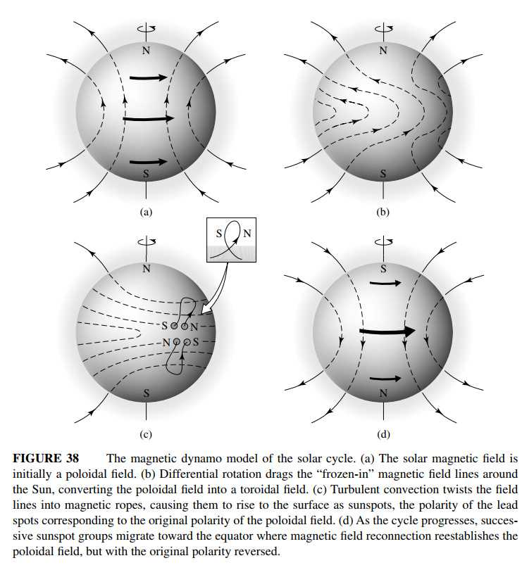
