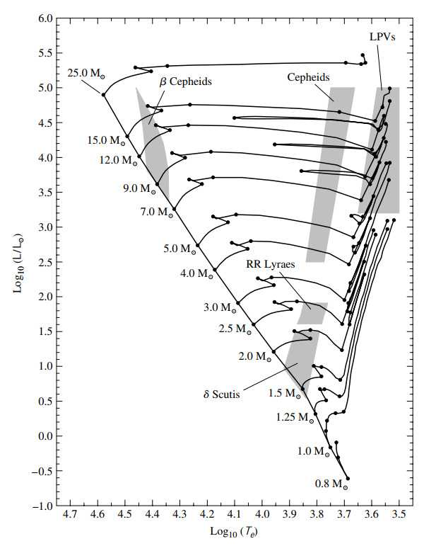
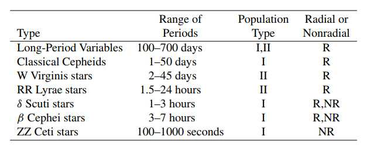
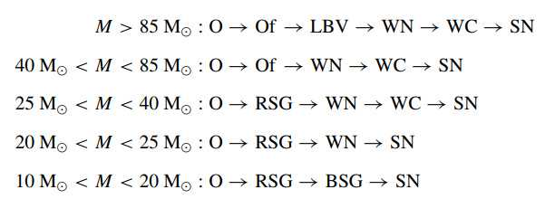
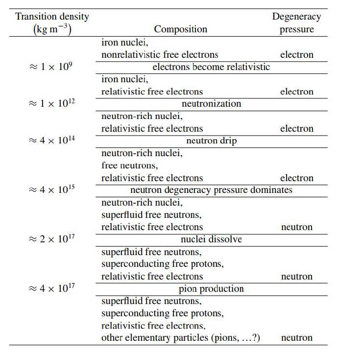

使用教材：An Introduction to Modern Astrophysics 

<!-- toc -->

### chapter 14

#### 1.造父变星(Cepheid) P537

classical Cepheid的absolute magnitude仅仅和其变光周期有关（有误差，体现在HR图上分布有宽度），所以测量他的视星等和周期（后者通过period-luminosity relation得到M）就可得知距离。pulsating star是一种非常短暂的现象，其光度的周期变化来自于其本身的收缩和膨胀。在HR图上，基本只分布在post-main-sequence阶段的一条窄垂直区域(称为**instability strip**). 演化到这个区域的 stars 会出现 pulsate, 离开区域就停止。

classification of pulsating stars:

其中最后一类是pulsating white dwarfs, 在HR图左下方。

#### 2.physcis of pulsation P545

光变周期和恒星内部声波传播有关。假设恒星密度均匀，可以推得光变周期

$$
\Pi\approx2\int^R_0 {dr\over v_s}=2\int^R_0 {dr\over \sqrt{\gamma P/\rho}}=\sqrt{3\pi\over 2\gamma G\rho}
$$

和密度平方根成反比，所以从很稀的supergiant到致密的white dwarfs其周期在变小。

半径方向上的振动(radial models)可以类比一端开口的驻波，根据驻点数量可分为fundamental mode, first overtone, second overtone..对应0,1,2...个驻点。根据深度不同振动振幅也不同，在表面的振幅最大。

Eddington's thermodynamics heat engine: 画出恒星某层的PV循环图，若环路积分大于0则驱动pulsation, 反之耗散。加算整个恒星后应能量收支平衡。由热机的推论，驱动pulsation层在高温阶段吸热，当达到最大压缩时吸热导致最大压强比最大压缩来得慢。

一个解释这个现象的模型被称为valve mechanism, 当恒星层被压缩时opacity上升，吸收更多中心辐射向外的能量。这一模型在partial ionization zones能够实现。当被压缩时，部分能量用于加大电离升温慢，所以opacity主要有变大的density决定，从而压缩上升。这一机制被称为$\kappa$-mechanism. 同时因为升温慢，所以会自然接受别的区域的能量，称为$\gamma$-mechanism.

在instability strip区域内的pulsating stars主要来源是partial hydrogen and helium ionization zones，根据位置不同区域深度也不同，则激发的振动模式也有区别。$\beta$ Cephei类的由于很热很亮，起效的是极高温(100000K)下的iron. opacity在达到这个温度时有一个bump.

具体分析pulsation需要解非线性的流体运动方程，如果假设振动很小可以decoupling到linear equation，参见P554例子。根据adiabatic index $\gamma$ 的不同存在一stability condition, 见P557。

#### 3.nonradial pulsation P557

 一些pulsating star是非径向变化的，它的有些部分膨胀的同时一些部分收缩。具体的angular pattern可用球谐函数描述。其中分为引力驱动的g-mode和压强驱动的p-mode. 

g-mode和**buoyancy/Brunt-Vaisala frequency** 部分见P562. 

### chapter 15

#### 1.post-main-sequence evolution of massive stars

Of stars: O supergiants with pronounced emission lines. R/BSG: red/blue supergiants. SN: supernova.

LBV: luminous blue variables. WN/WC/WO: Wolf-Rayet stars 的一类，宽发射线，有氦和对应标号的元素部分

#### 2.classes of supernova

Type I: 没有氢谱线，细分为有强Si II线的Type Ia和有He线的Ib, 两者均无的Ic. 短命的massive stars大多和后两种有关。三种SN在luminosity达到最大后的衰减曲线较为类似。Ia的SN和其余分类的SN来自于不同的天文事件。

Type II: 有强氢谱线。根据luminosity衰竭曲线的区别分成Type II-p(plateau, 衰减过程有平台期)和Type II-L (linear, 无平台). 前者出现频率更频繁。

**core-collapse supernova**: 包括除Ia外所有类型。当post-main-sequence stars进行到烧出iron cores的阶段，其核心温度会极高并发生**photodisintegration**. 使原子核裂变，产生的p迅速和电子结合变成中子放出neutrino(这部分放能远高于辐射). degenerate pressure of electron下降，导致整个核心骤缩，直到密度达到强相互作用起效的程度。核心部分先停止收缩并向外传出pressure wave, 其到达正在下落的外层后基本停下形成**accretion shock**， 能量传递给外层使之进一步photodisintegration. 此时与电子结合产生的neutrino也有一部分被吸收，让shock能继续向外层传播（不然就会坍缩回去，直接形成remnant，没有SN). shock会推着剩下的star外层向外扩散。当扩散到一定大小后到达optical thin就会通过光子辐射出极其巨额的能量。

**light curves**: SN的光度曲线主要是shock激发表层氢辐射/shock波前行进时合成的重元素衰变，可以通过测量光度的下降判断半衰期，进而得知此元素。

#### 3.Gamma-Ray Bursts (GRBs) P601-608

故事从略，探测器收到的能流密度被称为fluence. 持续大于2s的被称为**long-soft GRBs**, 反之被称为**short-hard GRBs**. soft和hard指低能/高能计数的数量。前者和supernova有关，后者和neutron star或者黑洞有关。

long-soft GRBs的两个模型：collapsar(足够大质量恒星坍缩形成中子星/黑洞和debris disk)，supranova(在坍缩后黑洞延迟产生)，两者均通过highly relativistic jets实现。

#### 4.Cosmic Rays P608-611

stellar粒子流，高能的粒子比低能的少很多。高能粒子可能是由supernova的shock加速形成的。

### chapter 16

#### 1.white dwarf P617-623

分类：**DA**（光谱只有压强致宽氢吸收线），**DB**（只有helium吸收线），**DC**（只有连续谱），**DQ**（碳线），**DZ**（金属线），**DAV**（variable的DA星），**DBV**（variable的DB星）。

#### 2.physcis of degenerate matter

Fermi energy: 一个简单推导见P623-625, 设电子在L长宽高的立方体中，量子数是三个维度的de Broglie wave数，转化为动量，色散关系为经典纯动能。填满的球半径是三个量子数构成的长度（模）。最后有

$$
\varepsilon_F={\hbar^2 \over 2m}(3\pi^2 n)^{2/3}
$$

平均能量是${3\over 5}\varepsilon_F$. 这和电子密度有关，如果电子密度足够大使$\varepsilon_F>{3\over 2}k T$，则会发生electron degenerate.

$$
{3\over 2}k T<{\hbar^2\over 2m}[3\pi^2({z\over A}){\rho\over m_H}]^{3/2}\to {T\over \rho^{2/3}}<{\hbar^2\over 3m_e k}[{3\pi^2\over m_H}({Z\over A})]^{2/3}\equiv D
$$

值越小degenerate越严重。

electron degenerate pressure: $p=-{\partial \varepsilon_T\over \partial V}=-{\partial\over\partial V}({3\over 5}\varepsilon_F)$即得.最后结果符合$P=K\rho^{5/3}$的形式，说明能用Lane-Emden的一些结果。

#### 3.Chandrasekhar limit P629-632

**Mass-Volume relation**设简并压等于hydrostatic equilibrium得到的结果

$$
{2\over 3} \pi G\rho^2 R_{wd}^2={(3\pi^2)^{2/3}\over 5}{\hbar^2\over m_e}[({Z\over A}){\rho\over m_H}]^{5/3}
$$

整理可得到$R_{wd}M_{wd}^{1/3}\approx constant$，即

$$
V_{wd}M_{wd}=constant
$$

质量越大，star密度就得越大产生更大的degenerate pressure来对抗gravity. 当密度越来越大，需要把relativity的影响考虑在内，这样结果等效于$P=K\rho^{4/3}$. 而这对pulsating是instability的。将relativity的压强和流体平衡的结果相等可估算Chandrasekhar limit, 但很不精确。 

#### 4.cooling for white dwarf stars P632-638

估算white dwarf的冷却速度、光度下降速度，与观测对比反推其诞生时间以及star formation的时间，具体略。

#### 5.neutron stars P638-646

接近Chandrasekhar limit的stars经过supernova后产生中子星，由neutron degenerate pressure对抗重力。

neutron star同样存在Chandrasekhar limit, 超过会坍缩成black hole. 由于角动量（接近）守恒，中子星从star的iron core坍缩而来导致极快的rotation. magnetic field同理。

中子星冷却最开始是**URCA process**，既neutron decay和electron capture循环，放出大量正反neutrinos. 接下来其他neutrino-emitting process进一步带走能量降温，直到到表面photon emit主导放能. 表面温度到$10^6 K$冷却会充分变缓，此温度也会保持恒定较长时间。

#### 6. pulsar P646-663

rapidly rotating neutron stars. 

电子环绕磁场线行进的辐射，若主要是环绕运动为synchrotron radiation，主要是沿磁场线运动则为curvature radiation. supernova remnant中的synchrotron radiation主要由中心pulsar供能。

pulsar同频段高峰的脉冲通过ISM光程不同，色散不同，故其色散程度可以用来衡量pulsar distance.

basic pulsar model: 设中子星的标准的magnetic dipole, 其与转轴成一角度，其dipole radiation可以直接计算。这些能量导致动能损失，与周期变换速率建立关系，可推知表面magnetic field intensity.

**magnetars**: magnetic field intensity 非常大，周期较长。可能是SGR(soft gamma repeaters, 发射hard和soft rays)的来源。

### chapter 17

#### 1.gravitational redshift and time dilation

$$
{\nu_\infty\over \nu_0}=\sqrt{1-{2GM\over r_0 c^2}}\to {\Delta t_0\over \Delta t_\infty}=\sqrt{1-{2GM\over r_0 c^2}}
$$

#### 2.schwarzschild metric

$$
ds^2=(1-{2GM\over rc^2})c^2 dt^2-(1-{2GM\over rc^2})^{-1}dr^2 -r^2d\theta^2-r^2\sin^2\theta d\phi^2
$$

example of a satellite: P693-695

#### 3.black hole

Schwarzschild radius, classification,frame dragging, Hawking radiation. not so useful. see P695-708
