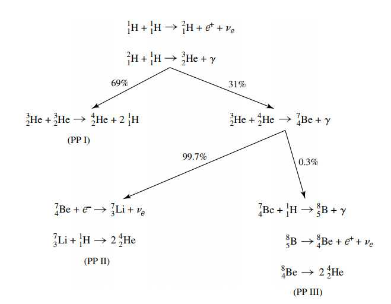
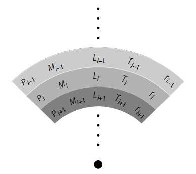
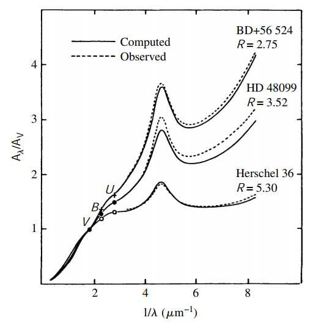
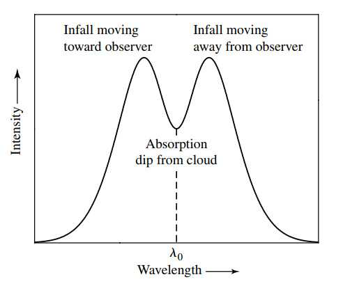
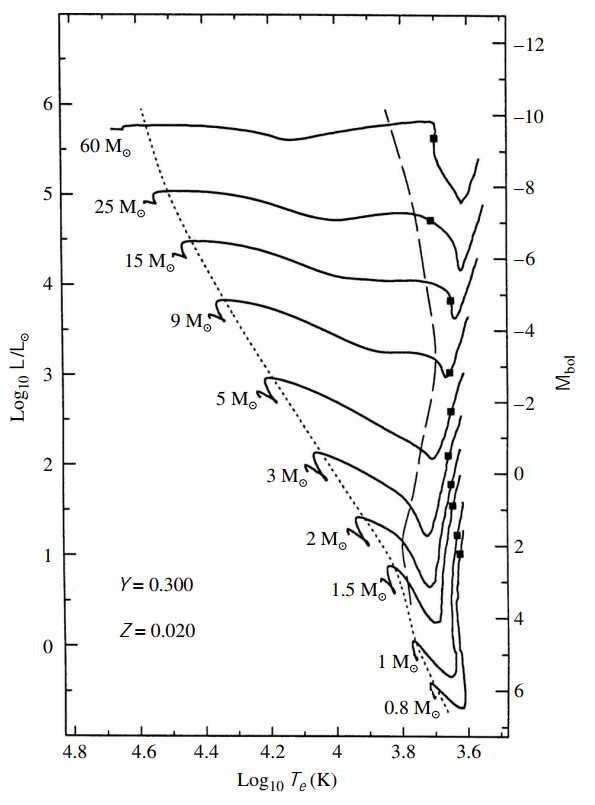
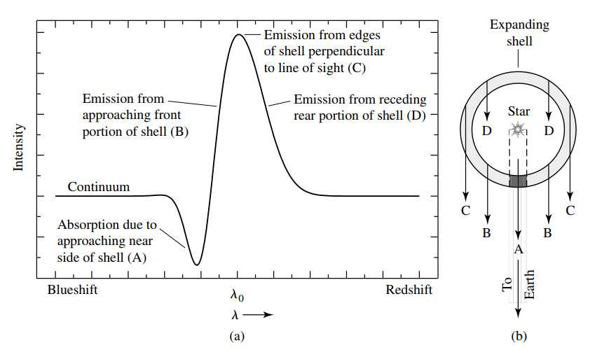
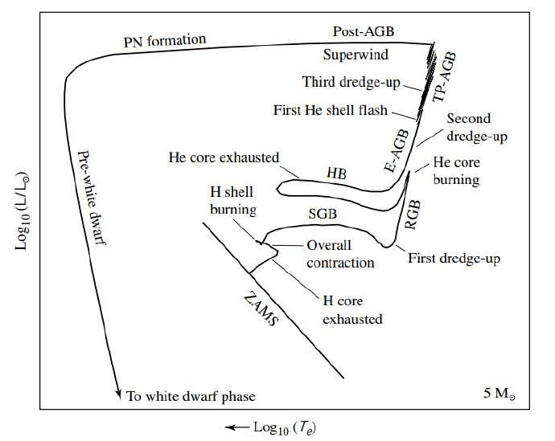
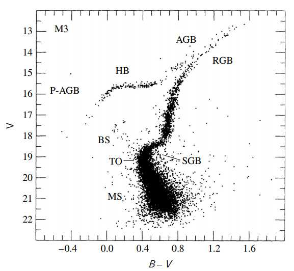
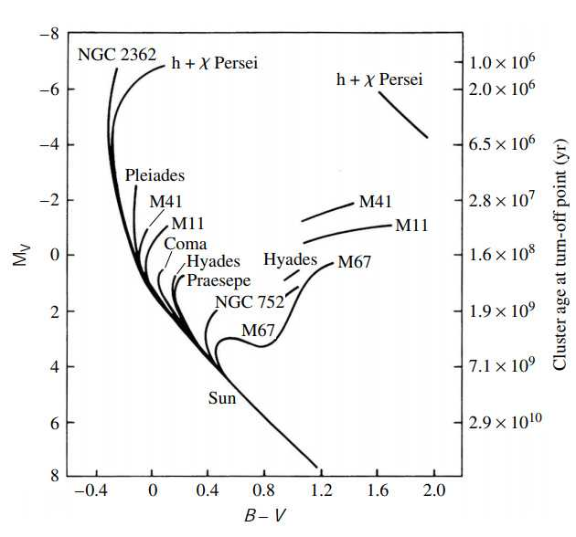

使用教材：An Introduction to Modern Astrophysics 

此部分为11-13章：恒星内部/星际介质与恒星形成/主序和（小质量）后主序演化

<!-- toc -->

### chapter 11 P373

#### 1.流体静力学平衡与状态方程

hydrostatic equilibrium

$$
\rho{d^2 r\over dt^2}=-G{M_r\rho\over r^2}-{dP\over dr},~{dP\over dr}=-G{M_r\rho\over r^2}=-\rho g
$$

其中$g\equiv GM_r/r^2$. 

mass conservation equation

$$
{dM_r\over dr}=4\pi r^2\rho
$$

pressure integral: $P={1\over 3}\int^\infty_0 v n_p pdp$, 带入麦克斯韦速率分布对非相对论气体结果即为理想气体方程$P=n kT$.利用平均分子量 $\mu\equiv {\bar{m}\over m_H}$ 的改写形式$P_g={\rho kT \over \mu m_H}$更常用.

考虑完全电离的气体 (附带游离的电子)，其平均分子量有近似形式

$$
{1\over \mu_n}=\Sigma_j {1+z_j\over A_j}X_j\approx 2X+{3\over4}Y+\langle {1+z\over A}\rangle_n Z
$$

X, Y, Z 分别代表氢、氦和其他元素的质量占比，$\langle {1+z\over A} \rangle$指对所有其他元素的该值进行加权平均，有时可以直接近似成$1/2$.

> 证明：单位质量的粒子数可以表达成$n=\Sigma_j (1+z_j){X_j\over A_j m_H}$，其倒数就是一个粒子的质量，可写出
> 
> $$
> {1\over \mu m_H}=n
> $$
> 
> 带入化简立得上式。

在压强积分里带入光子可以从一个方向得到$P={1\over 3}u$, 带入斯特潘公式后修正压强为

$$
P_t={\rho kT\over \mu m_H}+{1\over 3}aT^4,~a=\sigma/c
$$

#### 2.能量来源

**引力势能**：对球壳势能积分易估算恒星势能大约为

$$
U_g=\int -G{M_r 4\pi r^2\rho\over r}dr=-4\pi G \int^R_0 M_r \rho rdr\approx -{3\over 5}{GM^2\over R}
$$

其除二是恒星总能量。

假设恒星初始半径$R_i>>R$，并且luminosity基本不变，则恒星年龄大约可表达为$t_{KH}={\Delta E_g\over L}\approx {-E_f\over L}$. 此被称为Kelvin-Helmholtz timescale.

核反应：通过一些假设和推导能够得到单位体积内核反应速率

$$
r_{ix}=\int^\infty_0 n_x n_i \sigma(E)v(E){n_E\over n}dE
$$

其中$n_i,n_x$是两种反应粒子的数密度，$n_E dE$是根据麦克斯韦速率分布得到的能量分布，$n=\int n_E dE$是归一化因子。

$\sigma_{E}$是反应截面，可以对其能量的依赖关系做一个估计：将其视作A粒子能与多少面积内的B粒子反应的衡量，其覆盖面积大约是一个de Broglie波长半径的圆；另一方面其衡量了粒子穿透库伦势垒的概率大小，所以应该存在e因子，具体形式有

$$
\sigma_E={S(E)\over E} e^{-b E^{-1/2}}
$$

$E^{-1}$来自于第一个假设 ( $\pi \lambda^2 \sim \pi (h/p)^2\sim 1/E$ )，指数来自第二个假设 ( $e^{-2\pi^2 U_c/E}$, 其中$U_c/E={Z_1Z_2 e^2/4\pi \epsilon_0 r\over\mu_m v^2/2}$, $r\sim\lambda=h/p$). $S(E)$是一个（我们希望）随能量变化很慢的函数

具体形式带入最上式结果为

$$
r_{ix}=({2\over kT})^{3/2} {n_i n_x\over (\mu_m \pi)^{1/2}}\int^\infty_0 S(E)e^{-bE^{-1/2}e^{-E/k T}}dE
$$

其中$b\equiv {\pi \mu_m^{1/2}Z_1Z_2 e^2\over \sqrt{2}\epsilon_0 h}$. 上式积分内的部分在$E_0=({bkT\over 2})^{2/3}$时取到最大值。这一极为尖锐的峰被称为Gamow peak. 这一结果说明对核反应贡献最大的粒子实际上基本集中于这个能量附近。

虽然$S(E)$大部分情况都切实地随能量变化缓慢，但有时其也会在特定能量附近出现尖峰，这是因为其能量恰好等于原子核内部能级的能量差，这被称为resonance.

另一方面，plasma中大量自由电子可能会对库伦势垒起屏蔽作用，降低其实际的势垒高度，这一现象被称为electron screening. 对合成氦反应这一影响可能会达到10%~50%.

**power law**: 通常我们可以把上面的反应速度近似为在一个温度附近的指数形式（两粒子反应）

$$
r_{ix}\approx r_0 X_i X_x \rho^{\alpha'} T^\beta
$$

$\alpha'\approx 2$对于二体碰撞，$\beta$则在1到40之间取值，$X_i,X_x$是两种粒子的质量占比。利用上式写出单位质量核反应放出能量，假设每次核反应产生能量为$\varepsilon_0$

$$
\epsilon_{ix}={\varepsilon_o\over \rho}r_{ix}\to \epsilon_{ix}=\epsilon'_0 X_i X_x \rho^\alpha T^\beta
$$

$\alpha=\alpha'-1$.

**Luminosity gradient equation**: 假设单位质量产生的能量为$\epsilon=\epsilon_{nuclear}+\epsilon_{gravity}$，注意如果恒星在膨胀，$\epsilon_{gravity}$会是负数。设恒星球对称，易有

$$
{dL_r\over dr}=4\pi r^2 \rho \epsilon
$$

**核反应: Proton-Proton chains**（下图百分比是太阳内部的分支比）

来自 PP chains 的能量输出

$$
\epsilon_{pp}=0.241\rho X^2 f_{pp}\psi_{pp}C_{pp}T_6^{-2/3}e^{-33.8T_6^{-1/3}} W kg^{-1}
$$

其中$T_6\equiv {T\over 10^6 K}$无量纲，$f_{pp}(X,Y,\rho,T)\approx 1$为screening factor. $\psi_{pp}(X,Y,T)\approx 1$为不同聚变道同时发生导致的修正. $C_{pp}\approx 1$包括高阶的修正项。采用power law简化在$T=1.5\times 10^7K$附近 ($\beta=4$) 表达式为

$$
\epsilon_{pp}\approx \epsilon'_{0,pp}\rho X^2 f_{pp}\psi_{pp}C_{pp}T^4_6
$$

$\epsilon'_{0,pp}=1.08\times 10^{-12}W m^3kg^{-2}$

**核反应: CNO cycle** 利用碳氮氧做“催化剂”来从氢合成氦，具体过程与能量输出见P401.

CNO cycle的power law给出的对$T_6$的依赖达19.9幂次。这说明温度低的小恒星中主要能量来源是pp chains，温度高的大恒星中主要能量来自 CNO cycle. 这种区别对内部结构存在影响。

氢在燃烧成氦时平均分子量会上升，故气体压强会下降。这导致内部平衡破坏而恒星坍缩，增加其温度和密度来与增加的平均分子量抗衡。如果温度密度足够大，氦核也会被点燃。

**核反应: Triple alpha process** 氦进一步燃烧的反应，名字得自反应中需要三个氦核。具体过程与能量输出见P402.

此过程对$T_8\equiv {T\over 10^8 K}$ (无量纲)的依赖高达41.0幂次。

**核反应: Carbon and Oxygen burning** 指碳氧等重元素在极高温下进一步发生核反应的过程。有些反应endothermic (吸热)，但大部分均为 exothermic (放热).

#### 3.能量的转移

**辐射温度梯度**: 之前得到的辐射压强随半径变化的方程为

$$
{dP_{rad}\over dr}=-{\bar{\kappa }\rho\over c }F_{rad}={4\over 3}aT^3 {dT\over dr}\to {dT\over dr}=-{3\over 4ac}{\bar{\kappa}\rho\over T^3}F_{rad}
$$

用luminosity代替flux有

$$
{dT\over dr}=-{3\over 4ac}{\bar{\kappa}\rho\over T^3}{L_r\over 4\pi r^2}
$$

**对流与 Mixing-length theory**: 假设对流是从恒星深处升起的绝热气泡导致的，为了满足对流发生的条件。需要有实际恒星大气温度梯度大于绝热情况下的温度梯度（这样气泡的密度下降就会比外界慢，导致其一直能上升完成对流）

$$
|{dT\over dr}|_{act}>|{dT\over dr}|_{ad}
$$

具体推导参见P413-415. 其中需要使用理想气体绝热过程的状态方程，假设粒子数不变。比较(第二式导出参见P411-412)

$$
|{dT\over dr}|_{act}=-{3\over 4ac}{\bar{\kappa}\rho\over T^3}{L_r\over 4\pi r^2}，~|{dT\over dr}|_{ad}=-(1-{1\over\gamma}){\mu m_k\over k}{G M_r\over r^2}
$$

可以得到对流发生的几个condition (注意这里先假设的是全辐射的环境，所以实际的温度梯度用辐射的温度梯度代替): (1)opacity非常大；(2)电离严重导致热容非常大，即$(1-1/\gamma)\approx 0$；(3)核反应很剧烈导致辐射能流非常大。前两点常常同时发生于适中或小恒星表层，最后一点发生于大质量高温恒星内部反应区，特别是进行CNO cycle和triple alpha过程的恒星内部。

现假设这些气泡将在通过$l \equiv \alpha H_P$ (${1\over H_P} \equiv -{1\over P}{dP\over dr}$为pressure scale height) 的距离后将能量传递给环境并消失，这个距离被称为mixing length，$\alpha$是可调参数。单位体积的气泡传递的能量/能流应该有

$$
\delta q=(C_p \delta T)\rho \to F_c=\delta q \bar{v}_c=(C_p \delta T)\rho\bar{v}_c
$$

$\bar{v}_c$是气泡上浮的平均速度，其可以通过这个过程浮力对其做功估算得$\bar{v}_c=\sqrt{2\beta\langle f_{net}\rangle l\over\rho}$. 其中$\beta$是可调参数，用于估计在整个上浮过程中平均动能是最终动能的多少比例 (0~1). 代入净力的具体表达式并代换能流中的速度，最后有

$$
F_c=\rho C_P ({k\over \mu m_H})^2 ({T\over g})^{3/2}\sqrt{\beta}[\delta({dT\over dr})]^{3/2}\alpha^2
$$

注意$\delta T=\delta ({dT\over dr})dr=\delta({dT\over dr})\alpha H_P$, 假设恒星所有能流均由对流提供，即$F_c=L/4\pi r^2$，则上式可以反过来估算$\delta({dT\over dr})$亦即实际的温度梯度偏离绝热状态的大小（只有偏离足够小，能量才能主要被convection带走，一般发生于比较深的地方）

此部分推导具体参见P415-419.

#### 4.恒星模型的建立

目前所有的基本方程汇总

$$
{dP\over dr}=-G{M_r\rho\over r^2},~{dM_r\over dr}=4\pi r^2\rho,~{dL_r\over dr} =4\pi r^2\rho \epsilon
$$

$$
{dT\over dr}=-{3\over 4ac}{\bar{\kappa}\rho\over T^3}{L_r\over 4\pi r^2}(\mathrm{radiation})~\mathrm{or}~{dT\over dr}=-(1-{1\over\gamma}){\mu m_k\over k}{G M_r\over r^2} (\mathrm{adiabatic~convection)}
$$

注意这里假设对流是（几乎）绝热的，且要满足对流发生条件${d\ln P\over d\ln T}<{\gamma\over\gamma-1}$.

这些状态方程与 constitutive relations 即$P(\rho,T,\mathrm{composition}),\bar{\kappa}(\rho,T,\mathrm{composition}),\epsilon(\rho,T,\mathrm{composition})$联立既能建立完整的恒星模型，但一般来说这些方程过于复杂，没有解析解。但通过分层可以进行数值模拟。

**polytropic model and Lane-Emden equation**: 上述的第一和第二个方程配合压强和密度关系是自封闭的，一个有价值的假设是绝热$P=K\rho^\gamma$, 这种情况下这一模型被称为 polytropes (多方球)。联立三式可以最终得到 (具体过程参见P425-430).

$$
{1\over \xi^2}{d\over d\xi}[\xi^2 {dD_n\over d\xi}]=-D_n^n
$$

这一简化后的方程被称为Lane-Emden equation. 其中$\gamma\equiv (n+1)/n$, $n$被称为polytropic index. $\rho(r)\equiv \rho_c[D_n(r)]^n$. $D_n$的取值范围是0到1，易见$\rho_c$就是恒星中心密度。$r\equiv \lambda_n \xi$ 且有

$$
\lambda_n \equiv \sqrt{(n+1)({K\rho_c^{(1-n)/n}\over 4\pi G })}
$$

配套的边界条件是在表面密度等于0: $D_n(\xi_1)=0$, 和在中心密度变化为0: ${d D_n\over d\xi}|_0=0$. 

这个看上去很优雅的方程只有在n=0,1,5的时候才有解析解。5是index的上界，超过则质量不收敛 (n=5时恒星半径已经趋于无限大)。 单原子气体情况n=1.5，只有数值解。

另一个重要的index是n=3，被称为**Eddington standard model**. 设$P_g={\rho k T\over \mu m_H}=\beta P,P_r={1\over 3}a T^4=(1-\beta)P$. 联立消去T后得到$P=K\rho^{4/3}$，在$\beta$变化不大的情况下相当于$n=3$的情况，通过数值解能够得到有价值的结果。

**Vogt-Russell Theorem**: 质量与恒星组分唯一确定了其半径、luminosity和内部结构，以及其接下来的演化。其恒星组分的变化则来自于内部核反应情况。由于目前已经有很多反例被发现，所以这应该被视为一条普遍的规则，而非严格的定理。

**main-sequence and Eddington luminosity limit**: 根据目前模型可以理论计算出质光比以及main-sequence在H-R图上的位置，其质量分布跨三个数量级，luminosity跨6个数量级(越亮的主序星寿命越短). 根据光谱可以定位恒星在主序带的位置。

在恒星表面联立压强梯度-流量关系和流体静力学平衡方程得到

$L_{Ed}={4\pi G c\over \bar{\kappa}}M$

这被称为Eddington luminosity limit. 如果luminosity超过这一极限，则引力无法抵抗辐射压强，会导致恒星损失质量。

### chapter 12 P442

#### 1.interstellar medium and molecular clouds

恒星的光在传播过程中，会被星际尘埃和气体吸收与折射，这一光度上的减弱由$A_\lambda$表示

$$
m_\lambda=M_\lambda +5\log_{10}d-5 +A_\lambda
$$

根据$I_\lambda/I_{\lambda,0}=e^{-\tau_\lambda}$, 可以得到interstellar extinction和optical depth的关系

$$
A_\lambda=m_\lambda-m_{\lambda,0}=-2.5\log_{10}(e^{-\tau_\lambda})=1.086\tau_\lambda
$$

气体云中的optical depth可以表达为$\int^s_0 n_d(s') \sigma_\lambda ds'$, $n_d(s')$是尘埃数密度。设散射截面在气体中基本不变，有

$$
\tau_\lambda=\sigma_\lambda N_d,~N_d=\int^s_0 n_d(s')ds'(\mathrm{column~density})
$$

Mie Theory: 设尘埃几何截面$\sigma_g=\pi a^2$, 定义extinction coefficient:

$$
Q_\lambda\equiv {\sigma_\lambda\over \sigma_g}
$$

当光波长在尘埃尺寸附近时，$Q_\lambda\sim a/\lambda$; 当光波长趋于非常大时，$Q_\lambda\sim 0$; 当光波长非常小时，$Q_\lambda\sim \mathrm{constant}$. 后面的两种情况可以用水波遇到水中的沙子和一个岛屿做类比。显然这说明波长短的消光会更加严重，导致通过的光偏红。这一结果被称为**interstellar reddening**. 同时由于波长短的光被散射，所以从其他方向观测能够看到散射光线，这被称为 blue **reflection nebula**.

Molecular contribution: Mie理论在短波段的拟合并不好，消光$A_\lambda$在217.5nm处存在一个尖峰。这和石墨 (graphite) 的吸收线相符合，其可能是星际尘埃的主要成分之一；另一个可能的尖峰来源是多环芳烃(polycyclic aromatic hydrocarbon, PAHs). 其C-C和C-H键可能是散射尘埃云处于$3.3\mu m\sim 12\mu m$发射带的来源，这一区域的发射带被称为unidentified infrared emission bands. $9.7\mu m$和$18 \mu m$的吸收线可能分别来自硅酸盐中拉伸的Si-O键和弯曲的Si-O-Si键。~~化学大失败，完全不懂~~

星际尘埃的散射光的重要特点是其有一定的偏振性，大约百分之几的程度并且取决于波长。这说明尘埃颗粒不会是完美的球形，并且应有一定的空间取向。这种情况最可能的原因是尘埃处于一个弱磁场中。

**21-cm radiation of Hydrogen**: 各种类型的氢($H I,H II,H_2$)是**interstellar medium(ISM)**中气体部分的主要成分（剩下的大部分是氦，一小部分是重元素）。在**diffuse interstellar hydrogen clouds** 中氢大多数以中性氢原子的基态存在，这一基态在电子-质子自旋同方向和电子-质子自旋反方向的状态之间跃迁时会发出光子，对应的波长是21cm。这一自发跃迁发生的概率是非常小的，但在足够多的介质中仍然能够观测到这种现象。21cm线是定位和确定中性氢原子(H I)密度的重要手段之一，同样可以用来估算径向速度（多普勒）和磁场强度（塞曼效应）。21cm线在星系特征和动力学性质测量中特别重要。

当21cm做吸收线时，由于其极低的发生率，其线心处也可能是optical thin的，且有$\tau_H\sim {N_H\over T\Delta v}$. 其中$\Delta v$是谱线的半宽度（由于主要是多普勒致宽，所以单位也会用速度单位），$N_H$是中性氢的column density.

在$A_V<1$时，气体和尘埃是混杂分布的，但当$A_V>1$时，尘埃的column density增速会超过气体的，说明有新的物理机制出现。optical thick 的尘埃层能够阻挡紫外光子威胁到分子气体，同时还能帮助游离的原子形成分子(具体过程略，P450)，足够厚的单原子氢也能起到阻挡分子氢的紫外光解 (photodissociation). 

**Molecular Tracers of $H_2$**: 分子氢不发射21cm线，并且只有在2000K以上才会通过 rovibrational bands在方便观测的波段产生可观测辐射。在通常很冷的ISM中，我们使用其他的分子作为tracer，假设其与分子氢的比例一定来测定后者的比例。最常见的tracer 是CO，其他还有包括$CH,OH,CS,C_3H_2,HCO^+,N_2H^+$. 又是也会用同位素分子比如$^{13}CO,C^{18}O$.

**Interstellar clouds的分类**

diffuse molecular clouds/translucent molecular clouds: 氢主要以原子形式存在，在column density高的地方能找到分子氢。$1<A_V<5$. 这种clouds的condition和diffuse hydrogen clouds存在，但质量更大。$T:15\sim50K$, $n:5\times 10^8 \sim 5\times 10^9 m^{-3}$, $M:3\sim 100 M_\odot$. 尺度大约有几个秒差，和 diffuse hydrogen clouds 一样形状不规则。

Giant molecular clouds: GMCs的结构比较复杂，$T\sim 15K$,$n:1\times 10^8m^{-3}\sim 3\times 10^8 m^{-3}$, 一般有$10^5M_\odot$ 质量有时也会达到$10^6M_\odot$. 尺度一般50秒差。著名的马头星云(Horsehead Nebula, Barnard 33)就是Orion GMCs的一部分。银河内有数千个GMCs. Dark cloud complexes是clouds中密度较高的部分, 其上是clumps和dense cores，密度逐步递增。在GMCs的有些区域还存在hot cores，消光非常高，密度非常大，温度也会上升到$100\sim 300K$. 这些区域通常存在年轻的O或B型恒星，说明是最近新形成恒星的区域。

Bok globules: 近球形的高密度分子云，消光较高，尺寸在1秒差之内。几乎所有Bok globules内部都有新生成的恒星，存在active star formation.

（具体数据参阅P452）

clouds含有大量其他分子，从简单的CO到复杂的有机物如$HC_{11} N$.  尘埃在这些分子的合成中起了重要作用，有些呈固态附着在尘埃表面。有些直接在气相合成。

clouds主要热源是cosmic rays, 以及紫外辐射。冷却方面主要依靠红外辐射，因为波长长的辐射才容易穿透cloud.

目前interstellar dust的来源还未明确，是ISM性质研究的重要领域之一。

#### 2.恒星的形成

**Jeans criterion**: 根据virial theorem，稳定的引力自束缚系统满足$2K+U=0$，当两倍动能小于势能时一团气体就会坍缩，进而发展为protostar. 设$U=-{3\over 5}{GM_c^2\over R_c},K={3\over2}N k T$ 得到坍缩的极限质量

$$
M_J\ge({5kT\over G\mu m_H})^{3/2}({3\over 4\pi \rho_0})^{1/2}
$$

这被称为Jeans mass. 其中$\rho_0$是假设气体团密度恒定$\rho_0={4M_c\over 3\pi R^3_c}$, 这情况下有Jeans radius

$$
R_J\ge\sqrt{15kT\over 4\pi G \mu m_H \rho_0}
$$

若这团气体收到外界压强的影响（在GMCs中)则这一极限变为

$$
M_{BE}={c_{BE} v^4_T\over P^{1/2}_0 G^{3/2}},~v_T\equiv \sqrt{kT\over \mu m_H},~c_{BE}\approx 1.18
$$

这被称为**Bonnor-Ebert mass**.

**homologous collapse**: 假设坍缩过程等温（只要恒星optical thin，辐射就能带走多余的引力势能），同时压强梯度很小，则气体团表面的运动学方程为${d^2 r\over dt^2}=-G{M_r\over r^2}$. 注意此处$M_r={4\over 3}\pi \rho r_0^3$为一常数因为气体团在坍缩。标准套路解此方程后（具体参见P459-460），我们得到恒星坍缩到一点的耗时为

$$
t_{ff}=\sqrt{3\pi\over 32G\rho_0}
$$

这被称为**free-fall timescale**. 上式和半径无关，说明只要一开始的气体团密度均匀，那么所有的点都会在同一时间落到一点上，同时任何位置上的密度增速都是一样的。这被称为**homologous collapse**. 如果气体团中心密度更高一些，那么靠近中心部分的气体就会更快地落到一点，密度也上升得更快。这被称为**inside-out collapse**.

**Fragmentation of collapsing clouds**: 如果初始气体团是完美地均匀密度，那么最后生成的会是一颗超级巨大的恒星，但实际上由于密度上的不均匀，在气体团收缩密度上升的过程中，气体团的局部会超过Jeans mass从而局域地开始坍缩（注意如果温度不变，密度上升会导致Jeans mass下降）。所以最后形成的往往是数颗的恒星系统或者含有成百上千颗恒星的clusters. 

这个fragmentation的过程无法永远持续下去，因为密度上升很快会出现向optical thick的转变，等温坍缩会因此逐渐转化成绝热坍缩（实际过程应当介于两者之间），而代入绝热方程$T=K''\rho^{\gamma-1}$后Jeans mass得到

$$
M_J\propto \rho^{(3\gamma-4)/2}
$$

对原子氢给出$M_J\propto \rho^{1/2}$. 坍缩导致Jeans mass上升。**故绝热坍缩中是存在质量下限的（注意等温坍缩仅在坍缩开始时有下限，一但开始就不会停止，绝热坍缩则可能在中途停止）**。这一质量下限在P463有一个粗略估计。

如果考虑磁场的影响，由于气体团收缩时磁场的增加，其对应的magnetic pressure也会增强。这一过程对抗坍缩。由于磁场不会自行decay，被磁压平衡的坍缩将一直不会继续。考虑磁场后的极限质量见P464, 超过此质量的气体云被称为magnetically supercritical; 反之为magnetically subcritical.

Ambipolar diffusion: 未达到坍缩质量的气体云可能通过数团并合或者磁场的重新排布超过坍缩质量，后者比较常见。一般中性原子在撞上磁场线上的离子时运动会被禁止，但有时引力作用下中性原子仍保有一定的净速度，这被定向漂移被称为ambipolar diffusion. 这种漂移会重构磁场，导致气体团超过坍缩质量。

**Protostellar evolution**: 第一阶段是等温坍缩，且中心密度高一些所以中心坍缩得快。当密度达到$10^{-10}kg m^{-3}$时中心转变为optical thick，坍缩向绝热发展。这导致中心坍缩变慢，达到静力学平衡。此时这块区域就被称为protostar. 由于optical thick引力势能将通过黑体辐射释放，既可以定义等效温度在H-R图上定位。其在H-R图上的轨迹被称为evolutionary track. 中心外层的物质继续下落并碰撞表面通过shock传递能量给核心。当温度上升到1000K时dust开始升华，这降低了opacity，但温度依旧在升高。到2000K时分子氢分离成氢原子，吸收能量导致pressure降低发生一步坍缩，直到再次静力学平衡。此时外界的accretion仍在继续，恒星内部的氘会最先开始燃烧，因为其反应截面比pp chains的第一步要大。氘耗尽后protostar luminosity下降有效温度稍降，进入pre-main-sequence阶段。

accretion阶段的optical thick吸收线两侧有infall gas的doppler effect导致的发射峰(?)

#### 3. Pre-main-sequence evolution

随着有效温度的上升，opacity主要由$H^-$主导，此时由于较大的opacity, protostar的大部分均由convection交换能量，这形成了H-R图上一条近似垂直的线（亮度下降有效温度略微上升），称为**Hayashi track**. 这一track的左侧是“允许”的静力学模型，右侧是“禁戒”的静力学模型（在其右侧有效温度过低而不能抵抗坍缩，它们会进一步收缩升温直到到达存在平衡的左侧）。随着温度进一步上升，中心的电离度变大从而降低opacity，核变成了radiation的，这让内部能量更有效地传递到表面并使protostar在Hayashi track的最低亮度点后反弹。这时其仍然在收缩，有效温度继续升高(接下来的路被称为**Henyey track**)。于此同时，温度已经可以支持核反应（pp chain的前两步和把C烧成N）在内部发生，核反应的放能逐渐取代引力势能的释放主导luminosity. 

由于CNO循环的高温度依赖，protostar中心存在较大的温度梯度，这导致这部分再次出现convection. 当luminosity达到局部最大时，核反应供能甚至会迫使中心膨胀使引力势能的贡献变成了负数。这一结果导致了有效温度和亮度的下降。当$^{12}C$差不多烧完后核心基本就已经进入了正式的核反应的阶段，PP chains的其他步开始发生，引力势能对luminosity的贡献基本消失。此时这颗protostar正式转变为main-sequence star.

1$M_\odot$的恒星的整个转变时标和$t_{KH}$接近，这一时间远远大于$t_{ff}$也就是气体团转变为pre-main-sequence的时标。

$M<0.5M_\odot$的恒星不足以消耗完全部的$^{12} C$所以在main-sequence前luminosity上升趋势会消失(他们不走Henyey track)。另外这些很小质量的恒星由于比较冷所以opacity会保持在较高的水平导致从内到外全部convection.

$0.013M_\odot<M<0.072M_\odot$的恒星中心不足以热到产生足够的核反应能量来对抗引力坍缩，其不能成为一颗烧氢的主序星，但由于能够进行核反应（烧氘，质量大的还能烧锂），所以和行星质量体有区分， 称为brown dwarf. 

对于非常大质量的恒星来说，核反应会快速地烧完$^{12}C$，并开始pp chains. 这种恒星离开Hayashi track几乎平行地通向main-sequence.

**Modification**: 上述过程有很多近似，包括忽略了rotation, turbulence, magnetic field和inhomogeneity的影响。以及外界因素如stellar wind和radiation and gravity of massive stars nearby. 气体团的初始半径也不能视作无限大，因为很多clouds的dense core的半径并不大，也不能忽略压强的影响。

protostar最开始能被看见的点连线被称为**birth line**，也可作为protostar luminosity的上界。质量$M>10M_\odot$的恒星产生可能不遵循上述的classical model. 因为这个模型缺乏大质量恒星和infall material的相互作用机制。有researchers认为massive star可能来自于一些小的stars的merge; 另一些则指出rotation的存在会使infall mass产生**accretion disk**, 最小化了protostar的电离辐射对这些material的影响。

**Zero-age Main sequence**: 指不同质量的stars刚刚进入main-sequence时连成的（对角）线，质量越大的恒星到达ZAMS的时间越短（死的也越快）。注意这里会产生问题，如果一个cluster里年轻的大质量恒星真的最先生成，那么他放出的强辐射会严重干扰其他低质量恒星的形成，这说明classical models需要modification.

**The initial mass function(IMF)**: 指一群恒星初始时具有特定质量的恒星数密度函数，自变量是质量，可表达成

$$
\xi(m)\Delta m=f(m)
$$

f的具体形式随模型而变。

**H II region**: 大质量恒星刚形成时依旧被一团气体和尘埃包裹，这时候恒星发射的紫外辐射能够电离基态的中性氢原子H I，因此这块区域被称为H II region. 这些电离的气体随后会recombination放出光子，其未必会直接回到基态，而有可能从其他激发态经过，从而发射出其他波段的光子。最常见的是n=3到n=2的红色光子，所以这些emission nebula看上去像绽放红光。假设$N$是大质量恒星单位时间放出的能够电离中性氢的光子数，其应该与单位时间recombination的氢原子数相同，后者可写为$\alpha n_H n_e=\alpha n_H^2$（假设一开始为中性氢气体，$\alpha$是recombination系数）,则H II region的尺寸可估算为（设球形，恒星本身半径忽略）

$$
r_s\approx ({3N\over 4\pi \alpha})^{1/3} n_H^{-2/3}
$$

此被称为Stromgren radius.

大质量恒星的形成会对周围包裹的剩余气体产生重大影响，特别是如果原来的气体团只是比较勉强地引力自束缚，在强辐射影响下，那些剩下形成的star和protostar就会被吹出去。特别地，由O和B型恒星组成的group被称为OB association

**以下是几种pre-main-sequence中比较重要的分类**

T Tauri Stars: 描述**低质量**($0.5M_\odot\sim 2M_\odot$)的pre-main-sequence星，是介于protostar和main-sequence之间的状态（主要在Hayashi track)左右。这类星体会发生不规律且快速的luminosity变化（从H-R图上看，分布在理论的演化线周围）, 说明物理环境非常不稳定。

T Tauri stars有Balmer线系，Ca II的强发射线以及锂的吸收线。还包括一些forbidden lines（这些线加方括号，如[O I]），这说明气体密度非常低。这类星体的谱线会出现如下图的**P Cygni profile**，说明其正在损失质量。根据Kirchhoff's laws，BCD处作为热而稀疏的气体有发射线，A处遮挡了更热的恒星光，所以是吸收线。蓝移说明其向我们靠近，气体是在膨胀。对应的有inverse P Cygni profiles, 吸收线红移而非蓝移，此时这说明有accretion.

FU Orionis stars: 有时T Tauri stars的accretion速度会极大地增加，同时luminosity也随即提升近四个星等。这类星环绕的accretion disk快速地把物质抛向中央恒星，使得inner disk有时会比中心恒星亮100到1000倍，同时存在高速（$300km s^{-1}$) wind. T Tauri stars一生中可能经历数次FU Orionis阶段

Herbig Ae/Be stars: 质量在2到10$M_\odot$之间的A与B型星，具有极强的发射线，他们可能被一些剩余的尘埃和气体包裹，目前研究的还不是很清楚。

Herbig-Haro objects: 年轻的前主序星喷出的高速jet和星际气体剧烈碰撞进而产生的可观测天体。有连续和分立的发射谱，和许多Protostellar的性质有关，目前物理还没有完全弄清楚。

debris disk, proplyds(protoplanetary disks)两种是与accretion disk相区别的disk, 这两种盘可能来自于旋转的clouds在收缩时需要保持角动量守恒，导致在垂直旋转轴的方向上的坍缩比沿着轴的坍缩要慢。但考虑旋转后，产生的最终恒星会存在极大的自转速度（接近崩解），和观测不符合。一个可能的解决方案是通过磁场带动stellar wind而带走角动量（类似solar wind），这说明mass loss可能在演化中起到重要作用。

### chapter 13

(此章开始知识点密度变大，本笔记索引化)

#### 1.main-sequence star evolution P493-499

low-mass: 低于$1.2M_\odot$质量的恒星主要依赖pp chains核反应供能，核心温度升高并且氢核逐渐转变为氦核，外层(envelope)部分膨胀导致effective temperature下降。当等温的氦核质量比例超过**schonberg-Chandrasekhar limit **时，核将在一个KH时标内坍缩。这一事件被定义为main-sequence phase的结束。

如果电子开始在大密度条件下开始degenerate, 恒星可能能够超过SC-limit。完全简并的电子气从基态开始占满低能轨道，有状态方程$P_e=K\rho^{5/3}$(注意这是n=1.5的polytropic equation of state). 低质量恒星在坍缩前都是部分简并，也有更轻的恒星在主序阶段的简并度更高以至于在核反应进入下一个阶段前都没有超过SC limit.

massive: 由于大质量核convective，所以核成分基本保持不变，但convection zone会收缩，对于$>10M_\odot$的恒星对流区在烧完氢前消失。大质量恒星在氢烧的差不多的时候开始收缩，同时增加effective temperature和luminosity. 开始收缩事件被定义为main-sequence phase的结束。

图在P494.

**Schonberg-Chandrasekhar limit**: 恒星能支持上层结构的等温核所占的最大质量比例为

$$
({M_{ic}\over M})_{SC}\approx 0.37 ({\mu_{env}\over \mu_{ic}})^2
$$

粗略证明见P499-502.

#### 2.post-main sequence evolution P503-519

**subgiant branch(SGB)**: 对于小和中质量($1M_\odot,5M_\odot$)的恒星，在中心氢烧完后会开始烧稍外侧的一层球壳里的氢，但后者在这之前会有一个整体的contraction. 随后在点燃球壳氢后evolution和小质量类似，envelope膨胀，effective temperature下降. [烧球壳氢烧到超过SG limit发生core collapse. 放出能量导致envelope expand和ET下降，HR上向右平移]. 这个过程被称为SGB

**red giant branch**: 和Hayashi track正好反过来，convection再次建立，坍缩时燃烧的球壳氢也随之收缩导致luminosity骤升，ET因为envelope expand而稍降。同时对流把内部核反应后化学成分变化的部分翻到表面使得能够光谱观测，称为**first dredge-up phase**

**red giant tip**: RGB到顶core的温度能够让He燃烧，使核膨胀，降低球壳氢的能量输出。这降低了luminosity, envelope收缩，ET再次上升。

Helium core flash: 低质量stars的氦核收缩到能燃烧后，为对抗高degeneration而爆发出来的能量极高（正常气体受热压强变大会膨胀降温，但简并气体不会，所以能量产生速度会升到非常高）。这也导致低质量的evolution在这一点后面的轨迹不好估算，因为变化过于剧烈。

**horizonal branch**: 类似于主序星的He核版本，RGB后恒星不再膨胀，由于triple-alpha reaction产生的高温度梯度产生了convective core，两者作用升温。随后He核烧完坍缩，恒星envelope再次膨胀和冷却(类似SGB)。HR图上先左平移再右平移。

**asymptotic giant branch**: 类似于He版的RGB, 此时会发生**second dredge-up**. early AGB(E-AGB)的内部有一层在烧He，在浅处有一层在烧H. 能量产出主要是He层。随后进入thermal-pulse AGB(TP-AGB), 此时H壳层燃烧为主要能量输出，但其燃烧给内部氦层提供燃料并周期性地使之发生helium shell flashes. 这一过程让氢层膨胀降温，随后氦燃烧减弱，氢层再次获得主导权并周期重复。由于flash的存在，此时会发生**third dredge-up**. 大量C被送到表面，称为carbon stars(正常情况都是oxygen多). 这类星光谱称C spectral type(与K和M type有重叠). C和M之间的光谱类型称为S.

**以下是$<8M_\odot$恒星的演化**：AGB时存在巨大的质量损失，是ISM的主要贡献之一，也称superwind. 这种大质量损失也是OH/IR source的来源. 后者指来自OH分子的maser emission, 是一种受激辐射，主要在infrared区段。

接下来是post-AGB时期，在HR图上左平移(blueward), 表面物质大量损失使内部更热的部分暴露出来，但随后由于没有的envelope氢层和氦层均熄灭，整个恒星冷却并露出核反应剩下的C/O核，覆盖薄薄的氢和氦。这就是**white dwarf stars**.

**planetary nebulae**: 指环绕（前）白矮星在AGB期间被吹飞的气体壳层，其在中心恒星的紫外辐射下电离并在可见光波段发光，其会在很短的时间内变成ISM.

#### 3.stellar cluster P520-525

**Population**: 大爆炸后最开始形成的metal-zero的恒星被归为**population III**, 随后的metal-poor恒星被归为**population II**. metal rich的恒星被归为**population I**. 星族I的恒星相对太阳速度比星族II低，且大部分分布在银河disk上，而星族II大多分布在其上方或下方。这和Galaxy evolution有关。

cluster指的是来自同一molecular clouds的恒星集群。因此如果排除其他因素，根据Vogt-Russell theorem, 他们的evolution state只取决于初始质量。其又分成globular cluster和galactic(open) cluster.

**spectroscopic parallax**: 近似把cluster中全部恒星的距离看做一样，那么其在H-R图上的分布和主序带只存在vertical的偏移。计算这一偏移即可得到这个cluster离地球的距离。这一方法也被叫做**main-sequence fitting**.

color-magnitude diagrams: 根据cluster各星的color index(B-V)和视星等作图，从上可以看到演化阶段。

**isochrones**：在color-magnitude图上将演化了相同时间的不同质量的恒星位置连起来，这种线被称为isochrones. 其恒星“线密度”取决于IMF（VR theorem的结果）和不同质量演化的速度区别。由于质量越大的恒星演化越快，所以这条线偏离main-sequence的**turn-off point**会变红变暗（向右下移动）. 观测这个点能够用于估算star，cluster，Galaxy的年龄。

**Hertzsprung gap**: 在C-M图中处在SGB段的star非常少，因为这一KH时标的阶段（超过SG limit而core collapse）非常快，这一恒星数量的空白被被称为赫氏空隙。但对于$<1.25M_\odot$的恒星这一坍缩并不明显，所以那些turn-off point已经到这种低质量的old cluster不存在这种gap. 另外P-AGB和AGB恒星也很少，因为演化飞快。

**Blue stragglers**: 在turn-point左上方存在的蓝亮主序星，根据演化他们应该不会存在在此处。这可能是因为处在一个binary star system中或者collision导致的。

