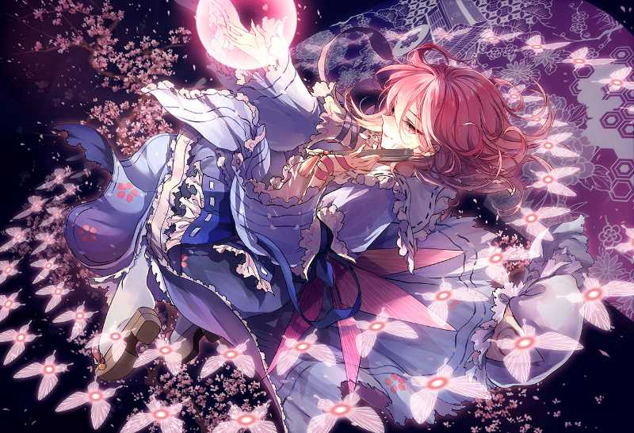

上半年在空间和Maliut公众号同步更新的音乐推荐歌单，目前处于停更状态*(:зゝ∠)*

[歌单网易云链接](http://music.163.com/#/m/playlist?id=602753137&userid=248409876)

### Vol.1

这期以轻音乐为主，个人听轻音乐的历史也蛮长了，所以推荐也从这类音乐开始。一些极为著名的曲子就不列了（风居住的街道，日晷之梦，river flows in you,etc.）

#### 1.Kan R. Gao-For River-Piano(Sarah & Tommy's Version)

来自To the moon的游戏配乐，极具剧情表现力的原创音乐是这部RPGMAKER游戏的两大台柱之一，这个版本的main theme变奏知名度比Johnny版本的小，我个人偏爱这个版本多一些。

#### 2.Kan R. Gao-Moonwisher

第二首依旧出自To the moon，John和River第一次见面的主题音乐，抒情满分的曲子。

#### 3.Laura Shigihara-Everything‘s Alright

To the Moon三连击（笑），这首插曲是整个游戏中唯一有词的歌，在游戏后期出现的时候催泪效果拔群。

#### 4.麻枝准-夏影

Air游戏配乐，一听就是夏天气氛的音乐。事实上高中第一次听的时候我没有玩过air，但依旧立刻喜欢上了这首曲子，如今重听这首曲子总会让我想起高中的夏日时光。

#### 5.麻枝准-渚

出自Clannad，古河渚的角色曲，整部游戏中印象最深的曲子，节奏把握也恰到好处。

#### 6.Martin Ermen-Apologize

纯音乐版本更加注重抒情，钢琴代替人声带来了不同的表现力。

#### 7.骆集益-1945

出自电影海角七号，最早听到这首曲子是因为高中的下课铃声。0:20开始的几个小节尤为让人印象深刻。

#### 8.全秀妍-안녕, 나의 은빛 돌고래 (Piano Solo)

你好，我的银色海豚。温柔的钢琴曲，适合情绪安稳时听，亦可助眠。

#### 9.薛啸秋-卡农的幻想

钢琴和提琴完美合作的代表，卡农就不需要我多介绍了，这个版本也是我最喜欢的卡农之一。

### Vol.2

本期依旧以轻音乐专题，以游戏和动画配乐为主。

#### 10.Szak-ナグルファルの船上にて -Orgel Ver.-

出自素晴日的游戏配乐。作为与某寒蝉类似的中段猎奇结局治愈的作品，这种矛盾在这首曲子上也得以表现。ナグルファル（纳吉尔法），是北欧神话中的大船，整个船据说是用死者的指甲所建成。当这艘船完成的时候，就是北欧诸神和巨人族的最后大战之时“诸神的黄昏”。在诸神的黄昏，纳吉尔法上载满巨人和来自冥界的死者进攻诸神们的宫殿。而带着这么一个悲壮标题的曲子是八音盒主役的抒情曲。标题和游戏剧情暗合，音乐本身的气氛舒缓优美，这也是这部游戏的亮点之一。

#### 11.Szak-夜の向日葵

同样出自素晴日，水上由岐的主题音乐。整首曲子极具空灵感，让人想起夜晚晴朗的天空，还有天空下仰望的少女。

#### 12.Szak-小さな旋律

素晴日三连击（笑x2），这首曲子在我心目中是整个游戏的灵魂。在一切混乱过去后来之不易的美好的每一天，和这首曲子一样带着沉重和感激。我不知道这是不是作者想要传达给玩家的，但它着实给我留下了深刻印象。

#### 13.朝倉紀行-Departure(Piano Solo)

出自浪客剑心配乐。一部老动画，但音乐令人惊异的超前。一首钢琴独奏完美映出了悲伤和决绝的心。

#### 14.Key Sounds Label-Bloom of Youth

出自库特Wafter的游戏配乐，依旧是大魔王熟悉的抒情风格。标题可以直译成绽放的青春，年轻真好啊（老头脸）

#### 15.天門-シュンとの时间

出自新海诚的动画电影 追逐繁星的孩子。这也是最后一部新海诚和天門合作的电影。新海诚在此之前的大部分作品包括秒五音乐均由天門执笔，其唯美而带有一丝忧伤的曲风和新海诚的剧情相得益彰，这首曲子很好地展现了这一点。

#### 16.Angel Note-Aliare ~on piano~

出自游戏 春季限定 的配乐，忧伤气质的钢琴曲，中段主题旋律相当抓人耳朵。

#### 17.梶浦由记-M01

出自空之境界 Vol.2 杀人考察（前）。温柔的钢琴旋律贯穿始终，比同专辑的M18显得更婉转一些。（又及空境各个专辑曲目名有毒，有兴趣可以看看）

#### 18.松田彬人-pure heart

出自动画 初恋限定。小心翼翼的钢琴独奏，气氛塑造极佳的曲子，适合看原作漫画的BGM（雾）

### Vol.3

本期是韩国抒情钢琴曲专题，适合充实读书/作业用歌单。以小众作者为主，知名钢琴家如李闰珉、全素妍等的作品就不推荐了。

#### 19.Love Rabbit-마음이 계절에 흔들리다（心情随着季节波动）

#### 20.Love Rabbit-사랑이 꽃피는 나무（爱之树）

#### 21.Love Rabbit-추억은 사랑을 닮았다（回忆中的爱情）

#### 22.Love Rabbit-이 음악이 들리니?（听到这音乐了吗？）

首先是Love Rabbit的四首曲子，曲风温柔，心情平和时食用更佳。与各类描写细腻的日系言情作品相性良好，比如《我想吃掉你的胰脏》（咦？）

#### 23.Reve-화(華)

百度找不到的作者=。=Reve重名的太多了。曲子的情绪起伏比较大，旋律也可以用漂亮来形容。

#### 24.July-달빛이 저무는 밤（月光迟暮之夜）

July海量节奏曲中的清流。钢琴solo引导全曲，中段提琴伴奏的插入也十分惊艳。

#### 25.조한빛-난 아직 겨울（我还在冬天）

这个作者的曲子很少但是作品质量都很高，有兴趣可以查询조한빛（这位重名不多）的其他作品，这里不多列。

#### 26.Crepe-4월의 눈동자를 지닌 소녀（The Girl With April In Her Eyes）

#### 27.Crepe-같은 하늘 아래에 서다（Under The Same Sky）

同一个作者，一首致郁，一首治愈。作者对音乐表达的情绪把控相当好（又及：这位作者的专辑封面画风着实独具特色）

### Vol.4

东方专题，选曲多为本作系列BGM改，兼有纯音乐和人声歌曲。

#### 28.Foxtail-Grass Studio-瞳の中で踊り踊られ

原曲少女さとり～3rd eye，古明地觉的角色曲。个人最喜欢的一个改曲版本，提琴和哥特曲风的搭配相得益彰，游戏内的渲染也做得很足。

#### 29.nayuta-绯色月下、狂咲ノ絶

#### 30.nayuta-滲色血界、月狂ノ獄

大小姐二小姐病娇曲两连发，本人不对听完后的各类不适反应和兴奋（？）反应负责（又及这种中二爆表的标题不止这两首，有兴趣的可以参见评论区）。

#### 31.Morrigan-第九楽章 Dawn of East End

原曲童祭。比原曲节奏慢一些的交响乐，气势豁然开阔，个人比较喜欢的版本（开头谜之像舌尖上的中国）。

#### 32.Foxtail-Grass Studio-雨待ち傘

原曲緑眼のジェラシー，地灵殿 水桥帕露西的主题曲「绿眼的嫉妒」。和第一首是一个社团的作品，原曲的旋律就很漂亮，改曲甚至做得更完美，气氛营造极佳（该社团的其他东方同人作品同样不错，例如云流れ）。

#### 33.ししまいブラザーズ-诗をひとつまみ

原曲冷吟闲酔，出自东方绯想天。zun和黄昏边境合作的格斗游戏（没毛病），这首的曲风活泼灵动，又有一丝神秘色彩。

#### 34.Golden City Factory-东の国の眠らない夜

#### 35.黒ヶ音研究室-Refined Vision

#### 36.彩音 ~xi-on~-ネイティブフェイス

最后是三首来自不同社团的节奏类作品，东方作为持续十余年的火爆IP，好的同人乐曲数不胜数，这里我只是摘取了极小的一部分做了推荐，权当抛砖引玉。欢迎各位潜藏的大佬也来推荐曲子=。=

### Vol.5

本期是白噪音专题，白噪声或白噪音，是一种功率频谱密度为常数的随机信号或随机过程。换句话说，此信号在各个频段上的功率是一样的，由于白光是由各种频率（颜色）的单色光混合而成，因而此信号的这种具有平坦功率谱的性质被称作是“白色的”，此信号也因此被称作白噪声。不同于其他噪音，白噪声会使人感到平静，更易集中注意力。同时白噪声相对舒缓、有规律，也可以帮助入睡。白噪声的代表有雨声、落叶声、海浪声、还有无聊老师上课的声音（雾）。同时白噪音兼有通常耳机播放音乐的覆盖效果，可以有效抵抗不很强的嘈杂声，例如在图书馆、宿舍旁人的键盘鼠标声，在教室自习走廊下课杂音等等（均亲测）。

#### 37.10 Hz Alpha Thunderstorm (Extended Version)

#### 38. Rainy Mood

虽然只有两首，但加起来90分钟，一首更比十首强（笑）。选择暴雨纯属个人口味。有一些网站也提供了白噪音自混成的功能，你可以自己选择白噪音的组合，例如[http://asoftmurmur.com/](http://asoftmurmur.com/)。

~~下期更新时间照常未定，主题也未定 *(:зゝ∠)*~~
