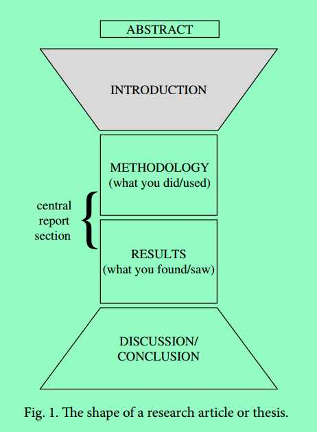

使用教材：Science Research Writing for Non-Native Speakers of English. 感谢曹伟光同学的分享。

<!-- toc -->

### Part 1. Introduction

​    从结构上来看，一篇论文的结构是对称的。你在Introduction部分做的事往往要在Discussion/Conclusion部分倒过来做一次。Introduction一般以较为宽泛的介绍起头，并逐渐收拢于你文章的主题；而结尾部分则相反，你需要从文章的结论部分过渡到研究展望和拓展上去。

#### Grammar and Writing skill

##### 时态

Present Simple(一般现在时) or Not

> (a) We found that the pressure **increased** as the temperature rose, which indicated that temperature **played** a significant role in the process.
> 
> (b)  We found that the pressure **increases** as the temperature rises, which indicates that temperature **plays** a significant role in the process. 

一般现在时用于表达客观承认的事实，可用于转述可靠性强的引用文献内容，以及论文本身得到的认为极为可信的结论（确认其他实验者能够重复的），若作者对这一点不能保证，最好使用过去时或者进行时行文。这一点在Result 部分里更为重要。

Past Simple(一般过去时)/Present Perfect(现在完成时)

> (a) I broke my glasses. (but it doesn't matter/I repaired them)
> 
> (b) I have broken my glasses.(and so I can not see properly NOW)

发生在过去，且与现在的事联系更大（直接相关）的事物用现在完成时。反之用一般过去时。

> (c) little attention has been paid to the selection of an appropriate rubber component. 
> 
> (d) little attention was paid to the selection of an appropriate rubber component. 

(c)说明这篇文章可能和这个话题有关，而(d)可能只是一句宽泛的事实阐述。

##### 连接词

表原因

​    due to (the fact that) / on account of (the fact that) / in view of (the fact that)

​    as / since / because (of)

​    *在可能引起混淆时最好不用since.

表结果

​    therefore / consequently / hence / as a result (of which) / which is why / so

​    *阐述一个结论的时候不要用so，不正式。

​    *then 有时可以用于结果，类似"if X then Y"的句式。

表对比/差异

​    however    / whereas / but / on the other hand / while / by contrast

​    *on the contrary/conversely的意思是**恰恰相反，完全相反**，注意应用场合。

​    *在可能引起混淆时最好不用while.

表转折

> (a) ___ it was difficult, a solution was eventually found.
> 
> (b) ___  the difficulty, a solution was eventually found.
> 
> (c) It was difficult; ___ a solution was eventually found. 

​    (a) Although / Even though / though

​    (b) Despite / In spite of / Regardless of / Notwithstanding

​    (c) nevertheless / however / yet / nonetheless / even so

​    *still和anyway过于不正式

表补充

​    in addition / moreover / furthermore / apart from that / apart from which

​    also / secondly (etc.) / in the second place (etc.) / what is more

​    *besides的意思和上述表达差不多，但是相比之下更强。

##### 被动/主动

​    We 在论文中可以用来指代你和你的研究组，但不能用于指代包括其他人的人类全体。所以当阐述一个”众所周知“的事实，且这个事实并非是由你的研究组得到的确切结论时，应当用被动+从句的形式（It is known that...）替换We开头的主动式（We know that...）

​    论文中尽量不要出现 **I** ，用被动形式来替换它。用 here 或者 in this study 之类的词来指明你说的东西出自你的研究。如果你需要用主动式，你可以用**This article / The present paper**来代替**we/I**. 这样同时可以避免使用过多被动式导致施动者不清。

##### 合理分段

​    每次写论文前把想讨论的观点/概念按逻辑顺序排列，然后扩展成段。每一段应以中心句起头，这一点在阅读论文时也很重要。

#### Build a Model

1. Establish the importance of this research topic 介绍研究课题的重要性​    此部分多用现在完成时或者一般现在时。
2. Provide general background information for the reader 提供背景知识​    提供多少和什么背景知识取决于你的研究领域，如果你的研究课题仅和一个专门的领域方向有关，你可以少提供或者直接进入主题，因为看你文章的人基本都有了足够的背景知识。相反你则需要提供足够的信息来帮助读者了解情况。​    如果你的背景知识来自其他文献，记得加上引用。放在背景知识里的文献应该足够经典和可靠。
3. Describe the general problem area or the current research focus of the field 描述该研究领域的热门研究问题或者焦点 ​    这个焦点应与你的研究课题有关。
4. Provide a transition between the general problem area and the literature review, then a brief overview of key research projects in this area 过渡到文献回顾并简介这一研究领域现阶段重要的研究项目和成果​    一般有三种回顾的顺序：按时间；按不同的模型/理论/实验方法；按和你研究的相关度。
5. Describe a gap in the research 指出当前的研究空白​    这是你开始课题的初衷。敢于指出先前研究中的问题（礼貌且学术）。根据你研究的具体课题，可能需要提供更多的背景知识（和参考文献）来帮助读者了解情况。研究性写作中的背景信息宁可稍微多些也不要过少。
6. Describe the paper itself and announce the findings 描述自己的文章和结论/发现​    例如：文章的构成和主题(This study is aimed on.../This paper is organized as follows:...); 文章所想实现的目的(The aim of this paper was/is...)

#### Vocabulary

to be continued
